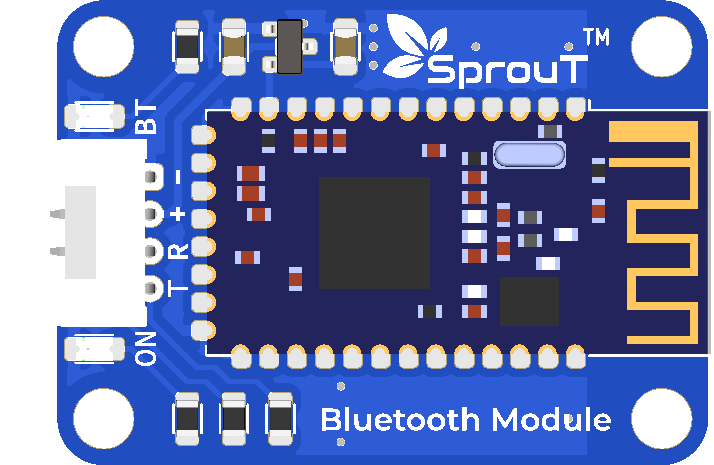

# SprouT Bluetooth Module

## Overview

<p align="center">
  
</p>

The **SprouT Bluetooth Module** is a wireless serial communication module used to send and receive data between a microcontroller and another device such as a smartphone, tablet, laptop, or another Bluetooth-supported controller.

This module works like a **wireless UART cable**. Instead of connecting your computer or phone directly to the microcontroller using wires, data can be sent through Bluetooth.

The module is suitable for beginner and intermediate projects such as:

- Wireless LED control
- Sending sensor readings to a phone
- Remote robot control
- Wireless serial monitor
- Motor control
- Home automation
- IoT prototype testing

---

## Description

The SprouT Bluetooth Module communicates using **UART serial communication**.

UART means **Universal Asynchronous Receiver Transmitter**. It uses two main signal lines:

| Signal | Meaning |
|---|---|
| TX | Transmit data |
| RX | Receive data |

The Bluetooth module receives wireless Bluetooth data and converts it into serial data for the microcontroller. It can also take serial data from the microcontroller and send it wirelessly through Bluetooth.

In simple words:

```text
Phone / Laptop
     ↓ Bluetooth
Bluetooth Module
     ↓ UART
Microcontroller / SprouT Baseboard
```

Example:

If a phone sends:

```text
LED_ON
```

The Bluetooth module passes that text to the microcontroller through UART. The microcontroller can then turn on an LED.

---

## Main Features

- Wireless serial communication
- Easy plug-and-play with SprouT baseboard UART port
- Can send and receive text commands
- Useful for remote control projects
- Can be used with Arduino IDE
- Can be used for simple phone-to-microcontroller communication
- Suitable for beginner Bluetooth projects
- Reduces the need for long USB cables

---

## Typical Specifications

| Item | Description |
|---|---|
| Module Type | Bluetooth UART module |
| Communication | UART Serial |
| Pins | BT, RX, +, TX, GND |
| Logic | Depends on module/baseboard design |
| Common Baud Rate | 9600 bps |
| Usage | Wireless serial data transfer |
| Compatible Boards | Arduino, ESP32, SprouT MakerBox baseboard, and other UART-supported boards |

> Note: The exact voltage and baud rate may depend on the module version. For SprouT baseboard use, plug it into the provided UART port.

---

## Pinout

From the module label, the Bluetooth module has the following pins:

| Module Pin | Function | Description |
|---|---|---|
| **BT** | Bluetooth control/status pin | May be used as enable, key, state, or mode pin depending on module version |
| **RX** | Receive | Receives data from the microcontroller TX pin |
| **+** | Power | Connects to the positive supply from the baseboard |
| **TX** | Transmit | Sends data to the microcontroller RX pin |
| **GND** | Ground | Connects to ground |

---

## Important UART Rule

When wiring UART manually, the connection must be crossed:

```text
Bluetooth TX  →  Microcontroller RX
Bluetooth RX  →  Microcontroller TX
Bluetooth GND →  Microcontroller GND
Bluetooth +   →  Baseboard VCC
```

However, on the **SprouT MakerBox baseboard**, the UART port is already designed for plug-and-play use. This means you normally only need to plug the module into the UART socket according to the correct orientation.

---

## Plug and Play with SprouT Baseboard

The SprouT baseboard has a dedicated **UART port** for modules like this Bluetooth module.

### Step 1: Turn off power

Before plugging in the Bluetooth module, turn off the baseboard power.

This prevents accidental short circuits or wrong connections.

---

### Step 2: Locate the UART port

Find the UART connector on the SprouT baseboard.

The UART port usually contains pins such as:

```text
BT / EN / KEY
RX
+
TX
GND
```

or similar labels.

---

### Step 3: Plug in the Bluetooth module

Insert the Bluetooth module into the UART port.

Make sure the pin labels match the baseboard labels.

Example:

| Bluetooth Module | SprouT Baseboard UART |
|---|---|
| BT | BT |
| RX | RX / UART RX socket side |
| + | + |
| TX | TX / UART TX socket side |
| GND | GND |

> If your baseboard socket is already designed for this module, do not manually cross the pins. Just follow the socket orientation.

---

### Step 4: Power on the baseboard

After the module is connected correctly, power on the baseboard.

The Bluetooth module LED should turn on or start blinking.

Common LED behavior:

| LED Behavior | Meaning |
|---|---|
| Fast blinking | Waiting for Bluetooth connection |
| Slow blinking | Pairing or standby mode |
| Solid light | Connected to a device |

> LED behavior may vary depending on the Bluetooth module firmware.

---

### Step 5: Pair with phone or laptop

Open Bluetooth settings on your phone or laptop.

Look for a Bluetooth name such as:

```text
MLT-BT05
BT05
HC-05
HC-06
Sprout_BT
Bluetooth
```

The actual name depends on the module firmware.

Common pairing passwords are:

```text
1234
0000
```

If both do not work, check the module label or configuration.

---

## How It Works

The Bluetooth module does not directly control the LED, motor, or sensor by itself. It only sends and receives data.

Example communication:

```text
Phone sends: LED_ON
Bluetooth module receives it
Bluetooth module sends LED_ON to microcontroller through UART
Microcontroller reads the command
Microcontroller turns on LED
```

Another example:

```text
Microcontroller reads temperature sensor
Microcontroller sends "Temperature: 28.5C" to Bluetooth module
Bluetooth module sends the text to phone
Phone displays the temperature
```

---

## Basic Arduino Example

This example reads commands from the Bluetooth module.

Command list:

| Command | Action |
|---|---|
| `ON` | Turn LED on |
| `OFF` | Turn LED off |
| `STATUS` | Send LED status |

```cpp
/*
  SprouT Bluetooth Module Test
  Board: Arduino Uno / Nano
  Communication: SoftwareSerial

  Wiring if using manual connection:
  Bluetooth TX -> Arduino D10
  Bluetooth RX -> Arduino D11
  Bluetooth +  -> 5V or baseboard +
  Bluetooth GND -> GND

  If using SprouT baseboard UART port, use the UART pins assigned
  by your baseboard.
*/

#include <SoftwareSerial.h>

#define BT_RX_PIN 10   // Arduino receives data from Bluetooth TX
#define BT_TX_PIN 11   // Arduino sends data to Bluetooth RX
#define LED_PIN 13

SoftwareSerial bluetooth(BT_RX_PIN, BT_TX_PIN);

String command = "";
bool ledState = false;

void setup() {
  pinMode(LED_PIN, OUTPUT);

  Serial.begin(9600);
  bluetooth.begin(9600);

  Serial.println("SprouT Bluetooth Module Ready");
  bluetooth.println("SprouT Bluetooth Module Ready");
}

void loop() {
  if (bluetooth.available()) {
    command = bluetooth.readStringUntil('\n');
    command.trim();

    Serial.print("Received: ");
    Serial.println(command);

    if (command == "ON") {
      ledState = true;
      digitalWrite(LED_PIN, HIGH);
      bluetooth.println("LED is ON");
    }

    else if (command == "OFF") {
      ledState = false;
      digitalWrite(LED_PIN, LOW);
      bluetooth.println("LED is OFF");
    }

    else if (command == "STATUS") {
      if (ledState) {
        bluetooth.println("LED Status: ON");
      } else {
        bluetooth.println("LED Status: OFF");
      }
    }

    else {
      bluetooth.println("Unknown command");
    }
  }
}
```

---

## ESP32 UART Example

If you are using ESP32, you can use HardwareSerial.

```cpp
/*
  SprouT Bluetooth Module Test
  Board: ESP32
  UART Example

  Example wiring:
  Bluetooth TX -> ESP32 GPIO16 RX
  Bluetooth RX -> ESP32 GPIO17 TX
  Bluetooth +  -> Suitable power from baseboard
  Bluetooth GND -> GND
*/

#define BT_RX_PIN 16
#define BT_TX_PIN 17
#define LED_PIN 2

HardwareSerial BTSerial(2);

String command = "";

void setup() {
  pinMode(LED_PIN, OUTPUT);

  Serial.begin(115200);
  BTSerial.begin(9600, SERIAL_8N1, BT_RX_PIN, BT_TX_PIN);

  Serial.println("ESP32 Bluetooth UART Ready");
  BTSerial.println("ESP32 Bluetooth UART Ready");
}

void loop() {
  if (BTSerial.available()) {
    command = BTSerial.readStringUntil('\n');
    command.trim();

    Serial.print("Bluetooth Received: ");
    Serial.println(command);

    if (command == "ON") {
      digitalWrite(LED_PIN, HIGH);
      BTSerial.println("LED ON");
    }

    else if (command == "OFF") {
      digitalWrite(LED_PIN, LOW);
      BTSerial.println("LED OFF");
    }

    else {
      BTSerial.println("Invalid command");
    }
  }

  if (Serial.available()) {
    BTSerial.write(Serial.read());
  }
}
```

---

## Testing Using Phone

You can test the Bluetooth module using a Bluetooth terminal app.

### Testing steps

1. Power on the SprouT baseboard.
2. Pair your phone with the Bluetooth module.
3. Open a Bluetooth terminal app.
4. Connect to the module.
5. Send:

```text
ON
```

The LED should turn on.

Send:

```text
OFF
```

The LED should turn off.

Send:

```text
STATUS
```

The board should reply with the current LED status.

---

## Suggested Command Format

For clean project communication, use simple text commands.

Example:

```text
LED_ON
LED_OFF
MOTOR_ON
MOTOR_OFF
READ_SENSOR
BUZZER_ON
BUZZER_OFF
```

For more advanced projects, you can use key-value format:

```text
LED=ON
MOTOR=120
BUZZER=OFF
```

Or JSON format:

```json
{"led":"on","motor":120}
```

For beginners, simple text commands are recommended.

---

## Common Applications

### 1. Wireless LED Control

Use the Bluetooth module to control an LED from a phone.

Example commands:

```text
ON
OFF
```

---

### 2. Wireless Sensor Monitoring

The microcontroller can send sensor readings to a phone.

Example output:

```text
Temperature: 28.5 C
Humidity: 70 %
Distance: 15 cm
```

---

### 3. Robot Control

Use Bluetooth commands to control robot movement.

Example commands:

```text
FORWARD
BACKWARD
LEFT
RIGHT
STOP
```

---

### 4. Motor Speed Control

Use Bluetooth to send speed values.

Example:

```text
SPEED=150
```

The microcontroller reads the value and controls the motor using PWM.

---

## Troubleshooting

### Problem: Bluetooth module does not turn on

Possible causes:

- Wrong power connection
- Module plugged in backwards
- Baseboard is not powered
- Loose connection

Solution:

- Check the `+` and `GND` pins
- Turn off power and reconnect the module
- Make sure the module is properly inserted into the UART socket

---

### Problem: Bluetooth does not appear on phone

Possible causes:

- Module is not powered
- Phone does not support the module Bluetooth type
- Module is already connected to another device
- Bluetooth name is different than expected

Solution:

- Restart the module
- Turn phone Bluetooth off and on again
- Check for names like `BT05`, `MLT-BT05`, `HC-05`, or `Sprout_BT`
- Disconnect from other devices first

---

### Problem: Pairing password does not work

Try common default passwords:

```text
1234
0000
```

If both fail, the module may have a custom password.

---

### Problem: Connected but no data received

Possible causes:

- Wrong baud rate
- TX and RX connection issue
- Wrong serial pins in code
- App is not sending newline
- Microcontroller code is reading from the wrong serial port

Solution:

- Try baud rate `9600`
- Check RX and TX pins
- Make sure the phone app sends newline `\n`
- Confirm that the code matches the baseboard UART pins

---

### Problem: Received text is unreadable

Example:

```text
ÿþxÜ@@
```

This usually means the baud rate is wrong.

Solution:

- Try changing the Bluetooth serial baud rate in the code:

```cpp
bluetooth.begin(9600);
```

Common baud rates:

```text
9600
38400
57600
115200
```

---

### Problem: Arduino upload fails when Bluetooth is connected

If the Bluetooth module is connected to Arduino hardware serial pins `D0` and `D1`, it may interfere with uploading.

Solution:

- Remove the Bluetooth module during upload
- Upload the code
- Reconnect the Bluetooth module after upload

This issue usually happens when using Arduino Uno or Nano hardware serial.

---

## Safety Notes

- Do not plug or unplug the module while power is on.
- Make sure `+` and `GND` are not reversed.
- If wiring manually to a 3.3V microcontroller, avoid sending 5V UART signals directly into the microcontroller RX pin.
- Use the SprouT baseboard UART port when available because it is designed for safer plug-and-play use.

---

## FAQ

### Is this module a sensor?

No. It is a communication module. It does not measure anything by itself.

---

### Can I use it to control an LED?

Yes, but the Bluetooth module only receives the command. The microcontroller controls the LED.

---

### Can I send sensor data to my phone?

Yes. The microcontroller can read sensors and send the readings through Bluetooth.

---

### Do I need Wi-Fi?

No. Bluetooth communication does not require Wi-Fi.

---

### Can I use this with Arduino IDE?

Yes. You can use Arduino IDE with UART serial code.

---

### Can I use this with PictoBlox?

Yes, if your board and PictoBlox setup support serial communication or Bluetooth serial blocks.

---

## See Also

- [SprouT Potentiometer](Potentiometer.md)
- [SprouT Button](Button.md)
- [SprouT LED](../output-components/LED.md)
- [SprouT MakerBox Baseboard Documentation](../../README.md)

---

*Last Updated: July 2026*  