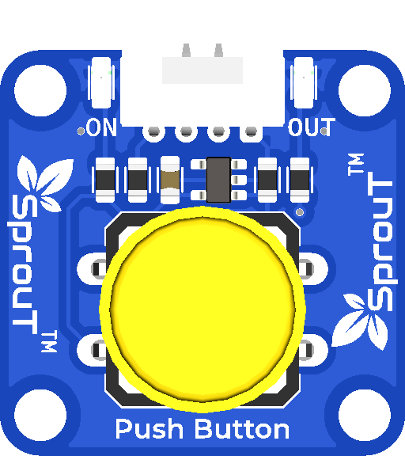

# Sprout Push Button

## Overview



The **Sprout Push Button** is a fundamental input component in the Sprout MakerBox ecosystem designed for creating interactive projects. It serves as a simple yet powerful digital input device that detects when a button is pressed or released, making it ideal for user interaction in countless applications.

---

## Description

### What is the Push Button?

The Sprout Push Button is a momentary switch component that generates digital signals based on physical button presses. When you press the button, it switches states and outputs a signal via the built-in signal output pin. The component features two indicator LEDs that provide real-time feedback about the button's status and connection.

### LED Indicators Explained

The push button features two important indicator LEDs:

#### **ON LED (Power Indicator)**
- **Status**: Illuminated when the button is properly **connected and powered up**
- **Meaning**: Indicates that data is being transmitted correctly and the component has stable power supply
- **When It Lights**: The ON LED will be continuously lit as long as the button receives power from the baseboard

#### **OUT LED (Signal Indicator)**
- **Status HIGH**: When the button is pressed, the OUT LED illuminates, indicating the signal output is **HIGH**
- **Status LOW**: When the button is released or not pressed, the OUT LED remains off, indicating the signal output is **LOW**
- **Meaning**: This LED provides visual feedback about the actual signal state being transmitted to your microcontroller or circuit

---

## Features & Specifications

### Core Features
- **Momentary Switch Design**: Toggles between HIGH and LOW states based on button press
- **Dual LED Feedback System**: Real-time visual indicators for power and signal status
- **Plug & Play Compatible**: Works seamlessly with the Sprout MakerBox baseboard ecosystem
- **Reliable Contact**: Durable push mechanism for thousands of reliable activations
- **Clear Visual Feedback**: Easy to understand status through intuitive LED indicators

### Electrical Specifications

#### **Voltage Rating**
- **Operating Voltage**: 3.3V - 5V DC
- **Input Power**: Accepts wide voltage range for compatibility with various microcontrollers
- **Signal Output**: Digital output (HIGH/LOW logic levels)

#### **Electrical Characteristics** *(To be completed)*
- Maximum Current Draw: *(Pending)*
- Signal Response Time: *(Pending)*
- Debounce Time: *(Pending)*

---

## Pin Compatibility

The Sprout Push Button can be connected to **any digital input pin** available on the Sprout MakerBox plug-and-play baseboard. The modular design ensures flexibility in your project layout:

- **Plug-and-Play Connection**: Insert the button's connector into any available pin slot on the baseboard
- **Universal Pin Support**: Compatible with all digital input pins on the baseboard
- **Hot-Swappable**: Can be connected or disconnected without powering down (when designed for it)
- **No Configuration Required**: Works immediately upon connection

---

## Common Applications

The Sprout Push Button excels in a variety of maker projects:

### **Interactive Projects**
- **Games & Challenges**: Build interactive games where players press the button to trigger actions
- **Quizzes & Learning Tools**: Create educational tools that require button input for answers
- **Counters & Scoreboards**: Track counts or scores with each button press

### **Robotics & Automation**
- **Robot Control**: Start, stop, or control robot movements with button input
- **Mode Selection**: Switch between different operational modes in your project
- **Emergency Stops**: Implement safety features with dedicated stop buttons

### **Smart Devices**
- **Home Automation**: Control lights, sounds, or other connected devices
- **IoT Projects**: Integrate button input into internet-connected applications
- **Alert Systems**: Trigger notifications and alarms

### **Creative & Experimental**
- **Musical Instruments**: Build DIY music boxes or drum machines
- **Art Installations**: Create interactive installations that respond to user input
- **Experiments**: Prototype sensor-based projects and proof-of-concepts

---

## How It Works

1. **At Rest State**: When not pressed, the button maintains a LOW signal output. The ON LED remains lit (indicating power), while the OUT LED is off (indicating LOW state)

2. **Upon Pressing**: When you physically press the button, it completes an internal circuit

3. **Signal Output**: The button sends a HIGH signal to the output pin. The OUT LED illuminates immediately to indicate this HIGH state

4. **Upon Release**: When you release the button, the signal returns to LOW, and the OUT LED turns off

5. **Repeat Cycle**: The button is ready for the next press, maintaining real-time responsiveness

---

## Connection Guide

```
Sprout Push Button PIN Configuration:
├── VCC (Power): 3.3V - 5V
├── GND (Ground): Ground connection
├── OUT (Signal): Digital output to your baseboard pin
└── Status LEDs: Built-in indicators (no additional connections needed)
```

---

## Integration with Sprout MakerBox

As part of the Sprout MakerBox plug-and-play ecosystem, the Push Button integrates seamlessly with any supported microcontroller or processing unit on the baseboard. Simply insert the connector and begin using it in your code - no additional setup or calibration required.

---

## Notes & Tips

- **Debouncing**: While the button provides inherent stability, consider software debouncing in your code for the most reliable readings in noise-sensitive applications
- **LED Feedback**: Use the LED indicators for quick troubleshooting during development
- **Power Supply**: Ensure your baseboard provides stable power to guarantee consistent LED operation
- **Durability**: The mechanical switch is rated for extended use; the button will maintain reliability through many activations

---

## Technical Specifications Summary

| Property | Value |
|----------|-------|
| Component Type | Momentary Push Button Switch |
| Voltage Range | 3.3V - 5V DC |
| Signal Type | Digital (HIGH/LOW) |
| Indicators | ON (Power), OUT (Signal) |
| Compatibility | All digital input pins on Sprout baseboard |
| Connection | Plug & Play connector |
| Activation Type | Momentary |
| Status | *(To be updated with additional specifications)* |

---

## See Also

- [Sprout MakerBox Baseboard Documentation](../../flow.md)
- [Input Components Overview](../README.md)

---

*Last Updated: July 2026*  
*Status: Documentation Framework Complete - Awaiting Voltage & Electrical Specifications*