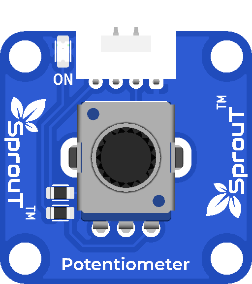

# SprouT Potentiometer

## Overview

<p align="center">
  
</p>

The **SprouT Potentiometer** is an adjustable analog input module. It allows users to control a value by turning a knob.

It is commonly used for:

- Adjusting LED brightness
- Controlling motor speed
- Setting volume level
- Changing menu values
- Calibration input
- User control knob

---

## Description

A potentiometer is a variable resistor. It has three main connections:

| Pin | Description |
|---|---|
| VCC | Positive voltage |
| GND | Ground |
| OUT | Adjustable analog output |

When the knob is turned, the output voltage changes.

The microcontroller reads this voltage using an analog input pin.

---

## How It Works

The potentiometer works as a voltage divider.

```text
VCC ─── Resistor Track ─── GND
              │
             OUT
```

When the knob turns, the OUT voltage changes between:

```text
0V to VCC
```

The microcontroller converts this voltage into a number.

Example for Arduino Uno/Nano:

```text
0V   = analog value 0
2.5V = analog value around 512
5V   = analog value 1023
```

Example for ESP32:

```text
0V     = analog value 0
1.65V  = analog value around 2048
3.3V   = analog value 4095
```

---

## Pinout

| Potentiometer Pin | Function |
|---|---|
| VCC | Connect to 3.3V or 5V |
| GND | Connect to ground |
| OUT | Connect to analog input |

---

## Plug and Play with SprouT Baseboard

The SprouT baseboard has an analog input port for modules like the potentiometer.

### Step 1: Turn off power

Turn off the baseboard before connecting the module.

### Step 2: Connect the potentiometer

Plug the potentiometer module into the analog input port.

Make sure:

```text
VCC → VCC
GND → GND
OUT → Analog Signal
```

### Step 3: Power on the baseboard

After connecting, turn on the baseboard.

### Step 4: Read the value

The microcontroller reads the potentiometer value using `analogRead()`.

---

## Arduino Example

```cpp
#define POT_PIN A0

void setup() {
  Serial.begin(9600);
}

void loop() {
  int rawValue = analogRead(POT_PIN);
  int percentage = map(rawValue, 0, 1023, 0, 100);

  Serial.print("Raw Value: ");
  Serial.print(rawValue);

  Serial.print(" | Percentage: ");
  Serial.print(percentage);
  Serial.println("%");

  delay(200);
}
```

---

## ESP32 Example

```cpp
#define POT_PIN 34

void setup() {
  Serial.begin(115200);
}

void loop() {
  int rawValue = analogRead(POT_PIN);
  int percentage = map(rawValue, 0, 4095, 0, 100);

  Serial.print("Raw Value: ");
  Serial.print(rawValue);

  Serial.print(" | Percentage: ");
  Serial.print(percentage);
  Serial.println("%");

  delay(200);
}
```

---

## Example Application: LED Brightness Control

```cpp
#define POT_PIN A0
#define LED_PIN 9

void setup() {
  pinMode(LED_PIN, OUTPUT);
}

void loop() {
  int potValue = analogRead(POT_PIN);
  int brightness = map(potValue, 0, 1023, 0, 255);

  analogWrite(LED_PIN, brightness);
}
```

---

## Troubleshooting

### Problem: Value always 0

Possible causes:

- OUT pin not connected
- Wrong analog pin selected
- GND not connected
- Module plugged in wrongly

---

### Problem: Value always maximum

Possible causes:

- OUT pin connected to VCC
- Wrong wiring
- Potentiometer damaged

---

### Problem: Value changes randomly

Possible causes:

- Loose connection
- No common ground
- Long wires causing noise
- Low-quality power supply

Solution:

Use averaging:

```cpp
int total = 0;

for (int i = 0; i < 10; i++) {
  total += analogRead(POT_PIN);
  delay(5);
}

int average = total / 10;
```

---

## FAQ

### Is the potentiometer digital or analog?

It is analog.

---

### Can I use it with ESP32?

Yes, but connect the output to an ADC-capable pin such as GPIO34, GPIO35, GPIO32, or GPIO33.

---

### Can I use it for menu control?

Yes. A potentiometer is useful for changing values such as brightness, speed, delay time, and calibration values.

---

## See Also

- [SprouT Bluetooth Module](Bluetooth-Module.md)
- [SprouT Button](Button.md)
- [SprouT LED](../output-components/LED.md)

---

*Last Updated: July 2026*  