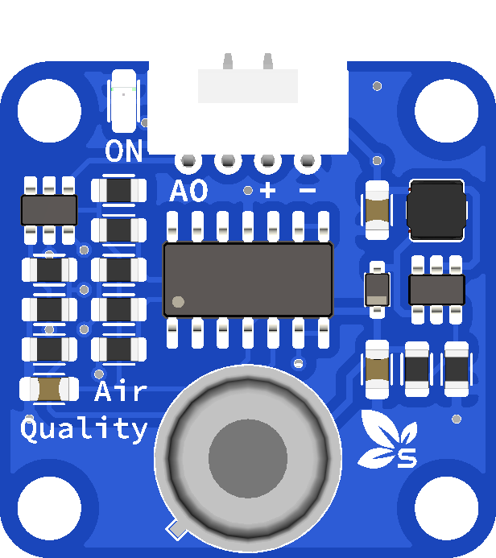

# SprouT Air Quality Sensor

## Overview

<p align="center">
  
</p>

The **SprouT Air Quality Sensor** is an input sensor module used to detect changes in air condition or gas concentration around the sensor.

It is commonly used in beginner electronics and IoT projects to monitor air quality, gas presence, smoke, or pollution level depending on the sensor version used.

This module can be used with the **SprouT MakerBox baseboard** through the sensor input port.

Common project examples include:

- Air quality monitoring system
- Smart room ventilation system
- Smoke or gas detection project
- IoT environmental monitoring
- Warning buzzer system
- LCD air quality display
- Automatic fan control system

---

## Description

The air quality sensor detects particles or gases in the surrounding air and converts the reading into an electrical signal.

Most air quality sensor modules provide either:

| Output Type | Description |
|---|---|
| Analog Output | Gives a changing value depending on air quality |
| Digital Output | Gives HIGH or LOW based on a set threshold |
| Both | Some modules provide both analog and digital output |

For SprouT beginner projects, the analog output is usually used because it gives a wider range of values.

Example reading concept:

```text
Clean air        → lower sensor value
Poor air quality → higher sensor value
Smoke / gas      → much higher sensor value
```

> Note: The exact reading depends on the sensor model, environment, warm-up time, and calibration.

---

## Important Note

This sensor is suitable for **educational and prototype projects**.

It should not be used as a certified safety device for gas leakage, fire detection, medical monitoring, or industrial air quality measurement.

For serious safety applications, use a certified gas detector or calibrated air quality monitoring equipment.

---

## Main Features

- Detects air quality changes
- Can be used for smoke or gas detection projects
- Supports analog reading
- Easy to connect with SprouT baseboard
- Suitable for Arduino and ESP32 projects
- Can trigger LED, buzzer, fan, or relay
- Useful for environmental monitoring projects

---

## Typical Specifications

| Item | Description |
|---|---|
| Sensor Type | Air quality / gas detection sensor |
| Output | Analog and/or digital depending on module |
| Operating Voltage | Usually 3.3V or 5V depending on module |
| Signal Type | Analog voltage or digital HIGH/LOW |
| Common Use | Air quality, smoke, gas, pollution detection |
| Compatible Boards | Arduino, ESP32, SprouT MakerBox baseboard |

> Always check your module label or datasheet for the correct operating voltage.

---

## Pinout

A typical air quality sensor module may have 3 or 4 pins.

### 3-Pin Version

| Pin | Function | Description |
|---|---|---|
| VCC | Power | Connect to 3.3V or 5V |
| GND | Ground | Connect to GND |
| OUT | Signal | Analog or digital output depending on module |

### 4-Pin Version

| Pin | Function | Description |
|---|---|---|
| VCC | Power | Connect to 3.3V or 5V |
| GND | Ground | Connect to GND |
| AO | Analog Output | Connect to analog input |
| DO | Digital Output | Connect to digital input |

---

## Plug and Play with SprouT Baseboard

The SprouT MakerBox baseboard has sensor ports that allow this module to be connected easily.

### Step 1: Turn off the power

Before connecting the air quality sensor, turn off the baseboard power.

This helps prevent wrong wiring or accidental short circuits.

---

### Step 2: Locate the sensor input port

Find the input port on the SprouT baseboard.

For analog air quality reading, use an **analog sensor port**.

The port usually contains:

```text
VCC
GND
Signal
```

or:

```text
+
-
S
```

---

### Step 3: Connect the sensor

Connect the module to the baseboard.

Typical connection:

| Air Quality Sensor | SprouT Baseboard |
|---|---|
| VCC / + | VCC / + |
| GND / - | GND / - |
| OUT / AO / S | Analog Signal Pin |

If the module has both `AO` and `DO`, use `AO` for analog reading.

---

### Step 4: Power on the baseboard

After checking the connection, power on the SprouT baseboard.

Some air quality sensors need warm-up time before giving a stable reading.

---

### Step 5: Read the sensor value

The microcontroller reads the air quality sensor using `analogRead()`.

The value can then be displayed on:

- Serial Monitor
- LCD
- OLED display
- Bluetooth app
- IoT dashboard

---

## How It Works

The air quality sensor changes its output voltage based on the detected gas or air condition.

The microcontroller reads this voltage as an analog value.

Example for Arduino Uno/Nano:

```text
0V   = analog value 0
2.5V = analog value around 512
5V   = analog value 1023
```

Example for ESP32:

```text
0V     = analog value 0
1.65V  = analog value around 2048
3.3V   = analog value 4095
```

The value can be converted into a simple air quality status.

Example:

```text
Low value    = Good air
Medium value = Moderate air
High value   = Poor air
```

---

## Arduino Example

```cpp
/*
  SprouT Air Quality Sensor Test
  Board: Arduino Uno / Nano

  Connection:
  Air Quality Sensor VCC -> 5V
  Air Quality Sensor GND -> GND
  Air Quality Sensor OUT -> A0
*/

#define AIR_SENSOR_PIN A0

void setup() {
  Serial.begin(9600);
  Serial.println("SprouT Air Quality Sensor Ready");
}

void loop() {
  int airValue = analogRead(AIR_SENSOR_PIN);

  Serial.print("Air Quality Raw Value: ");
  Serial.print(airValue);

  if (airValue < 300) {
    Serial.println(" | Status: Good");
  } 
  else if (airValue < 600) {
    Serial.println(" | Status: Moderate");
  } 
  else {
    Serial.println(" | Status: Poor");
  }

  delay(1000);
}
```

---

## ESP32 Example

```cpp
/*
  SprouT Air Quality Sensor Test
  Board: ESP32

  Connection:
  Air Quality Sensor VCC -> 3.3V or suitable baseboard VCC
  Air Quality Sensor GND -> GND
  Air Quality Sensor OUT -> GPIO34
*/

#define AIR_SENSOR_PIN 34

void setup() {
  Serial.begin(115200);
  Serial.println("ESP32 Air Quality Sensor Ready");
}

void loop() {
  int airValue = analogRead(AIR_SENSOR_PIN);

  Serial.print("Air Quality Raw Value: ");
  Serial.print(airValue);

  if (airValue < 1200) {
    Serial.println(" | Status: Good");
  } 
  else if (airValue < 2500) {
    Serial.println(" | Status: Moderate");
  } 
  else {
    Serial.println(" | Status: Poor");
  }

  delay(1000);
}
```

---

## Example Application: Air Quality Warning System

This example turns on a buzzer when air quality becomes poor.

```cpp
#define AIR_SENSOR_PIN A0
#define BUZZER_PIN 8

int threshold = 600;

void setup() {
  pinMode(BUZZER_PIN, OUTPUT);
  Serial.begin(9600);
}

void loop() {
  int airValue = analogRead(AIR_SENSOR_PIN);

  Serial.print("Air Value: ");
  Serial.println(airValue);

  if (airValue > threshold) {
    digitalWrite(BUZZER_PIN, HIGH);
  } else {
    digitalWrite(BUZZER_PIN, LOW);
  }

  delay(500);
}
```

---

## Calibration Guide

The air quality sensor value may be different depending on the environment.

A simple calibration method:

1. Place the sensor in clean air.
2. Open Serial Monitor.
3. Record the normal reading.
4. Create a threshold above the normal reading.
5. Test with smoke, gas, or poor air condition carefully.
6. Adjust the threshold in the code.

Example:

```text
Clean air reading: around 250
Poor air reading: around 700

Suggested threshold: 500
```

Then use:

```cpp
int threshold = 500;
```

---

## Applications

- Air quality monitoring
- Smoke detection project
- Gas detection project
- Automatic fan control
- Smart classroom monitoring
- Environmental data logger
- IoT air quality dashboard
- Warning light and buzzer system

---

## Troubleshooting

### Problem: Sensor value always 0

Possible causes:

- Signal pin not connected
- Wrong analog pin selected
- No power to sensor
- GND not connected

Solution:

- Check VCC and GND
- Make sure OUT or AO is connected to the analog input
- Check that the code uses the correct analog pin

---

### Problem: Sensor value always maximum

Possible causes:

- Wrong wiring
- Sensor output connected directly to VCC
- Sensor is damaged
- Incorrect voltage level

Solution:

- Recheck the wiring
- Try another analog pin
- Make sure the sensor voltage matches the board

---

### Problem: Reading is unstable

Possible causes:

- Sensor needs warm-up time
- Power supply is noisy
- Loose wire connection
- Airflow around sensor is changing

Solution:

- Wait a few minutes before taking readings
- Use stable power
- Use averaging in software
- Avoid placing the sensor near strong wind or fan during testing

---

### Problem: Sensor gets warm

Some gas-based air quality sensors have a heating element inside.

This is normal for certain sensor types.

However, if the module becomes extremely hot or smells burnt, turn off power immediately and check the wiring.

---

## FAQ

### Is this sensor analog or digital?

It depends on the module version. Some modules have analog output only, while others have both analog and digital output.

---

### Can this sensor detect exact gas type?

Most beginner air quality sensors cannot accurately identify exact gas type. They only show general air quality or gas concentration changes.

---

### Can I use it with ESP32?

Yes. Use an ADC-capable pin such as GPIO34, GPIO35, GPIO32, or GPIO33.

---

### Can I use it to trigger a fan?

Yes. The microcontroller can read the sensor value and activate a relay, transistor, or motor driver to control a fan.

---

### Does it need calibration?

Yes. For better results, record the normal clean-air value first and set a threshold based on your environment.

---

## See Also

- [SprouT Humidity Sensor](Humidity-Sensor.md)
- [SprouT Buzzer](../output-components/Buzzer.md)
- [SprouT LED](../output-components/LED.md)
- [SprouT Relay](../output-components/Relay.md)

---

*Last Updated: July 2026*  
*Status: Wiki-style component documentation*