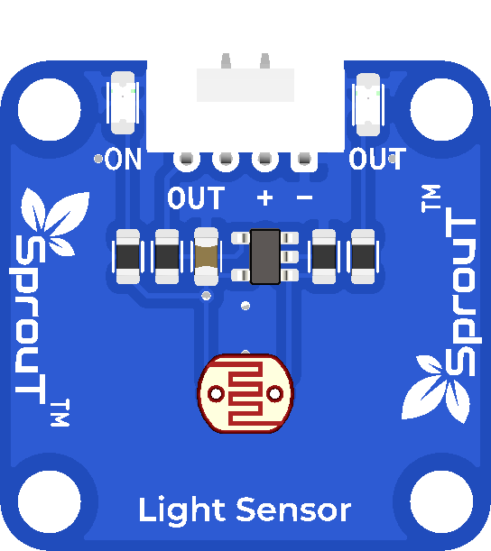

# SprouT Light Sensor

## Overview

<p align="center">
  
</p>

The **SprouT Light Sensor** is an input sensor module used to detect the brightness level of the surrounding environment.

The sensor is based on an **LDR**, which stands for **Light Dependent Resistor**.

An LDR changes its resistance depending on how much light falls on it. The SprouT Light Sensor converts this change into an electrical signal that can be read by a microcontroller.

Common project examples include:

- Automatic night lamp
- Light level monitor
- Smart lighting system
- Day and night detection
- LCD brightness display
- Security light trigger
- Classroom light experiment
- IoT environment monitoring

---

## Description

The Light Sensor detects the amount of light around it.

When the surrounding light changes, the sensor output also changes.

In general:

```text
Bright environment → sensor value changes toward one side
Dark environment   → sensor value changes toward the opposite side
```

Depending on the circuit design, the reading may increase or decrease when light increases.

Because of this, it is always recommended to test the sensor value using the Serial Monitor before setting a threshold.

---

## What is an LDR?

An **LDR** is a resistor that reacts to light.

Its resistance changes based on brightness.

Typical behavior:

```text
Bright light → lower resistance
Darkness     → higher resistance
```

The microcontroller cannot directly read resistance, so the module uses a circuit to convert the resistance change into a signal voltage.

---

## Main Features

- Detects brightness level
- Uses LDR light sensing element
- Simple 3-pin connection
- Easy to use with Arduino and ESP32
- Plug-and-play with SprouT baseboard
- Suitable for automatic light projects
- Can trigger LED, buzzer, relay, or display
- Useful for environment monitoring

---

## Typical Specifications

| Item | Description |
|---|---|
| Sensor Type | LDR light sensor |
| Output Type | Analog or threshold signal depending on module/baseboard |
| Pins | OUT, +, - |
| Operating Voltage | Usually 3.3V or 5V depending on module/baseboard |
| Detection | Light intensity / brightness |
| Common Use | Day-night detection, smart lighting, brightness monitoring |
| Compatible Boards | Arduino, ESP32, SprouT MakerBox baseboard |

> For most learning projects, the Light Sensor is read using an analog input so that brightness can be shown as a range of values.

---

## Pinout

The SprouT Light Sensor has 3 main pins.

| Sensor Pin | Function | Description |
|---|---|---|
| **OUT** | Signal Output | Sends light level signal to the microcontroller |
| **+** | Power | Connects to VCC from the baseboard |
| **-** | Ground | Connects to GND from the baseboard |

---

## Plug and Play with SprouT Baseboard

The SprouT MakerBox baseboard has input ports for sensors like the Light Sensor.

### Step 1: Turn off the power

Before connecting the Light Sensor, turn off the baseboard power.

This prevents wrong connection and accidental short circuits.

---

### Step 2: Locate the sensor input port

Find the sensor input port on the SprouT baseboard.

For brightness reading, use an **analog input port** if available.

The port usually contains:

```text
Signal
VCC
GND
```

or:

```text
OUT
+
-
```

---

### Step 3: Connect the Light Sensor

Connect the sensor to the baseboard.

| Light Sensor | SprouT Baseboard |
|---|---|
| OUT | Analog Signal Pin |
| + | VCC / + |
| - | GND / - |

Make sure the sensor is not plugged in backwards.

---

### Step 4: Power on the baseboard

After checking the connection, power on the baseboard.

---

### Step 5: Read the light value

The microcontroller reads the light sensor using `analogRead()`.

The value can then be used to decide whether the environment is bright or dark.

---

## How It Works

The Light Sensor changes its output depending on the brightness level.

Simple flow:

```text
Light shines on LDR
        ↓
LDR resistance changes
        ↓
Module output voltage changes
        ↓
Microcontroller reads analog value
        ↓
Program decides bright or dark
```

Example reading concept for Arduino Uno/Nano:

```text
0V   = analog value 0
2.5V = analog value around 512
5V   = analog value 1023
```

Example reading concept for ESP32:

```text
0V     = analog value 0
1.65V  = analog value around 2048
3.3V   = analog value 4095
```

---

## Arduino Example

This example reads the Light Sensor and displays the raw value on the Serial Monitor.

```cpp
/*
  SprouT Light Sensor Test
  Sensor: LDR Light Sensor
  Board: Arduino Uno / Nano

  Connection:
  Light Sensor OUT -> A0
  Light Sensor +   -> 5V
  Light Sensor -   -> GND
*/

#define LIGHT_SENSOR_PIN A0

void setup() {
  Serial.begin(9600);
  Serial.println("SprouT Light Sensor Ready");
}

void loop() {
  int lightValue = analogRead(LIGHT_SENSOR_PIN);

  Serial.print("Light Sensor Value: ");
  Serial.print(lightValue);

  if (lightValue < 300) {
    Serial.println(" | Status: Dark");
  } 
  else if (lightValue < 700) {
    Serial.println(" | Status: Normal");
  } 
  else {
    Serial.println(" | Status: Bright");
  }

  delay(500);
}
```

> If your reading becomes smaller when the light is brighter, reverse the threshold logic.

---

## ESP32 Example

```cpp
/*
  SprouT Light Sensor Test
  Sensor: LDR Light Sensor
  Board: ESP32

  Connection:
  Light Sensor OUT -> GPIO34
  Light Sensor +   -> 3.3V or suitable baseboard VCC
  Light Sensor -   -> GND
*/

#define LIGHT_SENSOR_PIN 34

void setup() {
  Serial.begin(115200);
  Serial.println("ESP32 Light Sensor Ready");
}

void loop() {
  int lightValue = analogRead(LIGHT_SENSOR_PIN);

  Serial.print("Light Sensor Value: ");
  Serial.print(lightValue);

  if (lightValue < 1200) {
    Serial.println(" | Status: Dark");
  } 
  else if (lightValue < 2800) {
    Serial.println(" | Status: Normal");
  } 
  else {
    Serial.println(" | Status: Bright");
  }

  delay(500);
}
```

---

## Example Application: Automatic Night Lamp

This example turns on an LED when the surrounding area becomes dark.

```cpp
#define LIGHT_SENSOR_PIN A0
#define LED_PIN 8

int darkThreshold = 300;

void setup() {
  pinMode(LED_PIN, OUTPUT);
  Serial.begin(9600);
}

void loop() {
  int lightValue = analogRead(LIGHT_SENSOR_PIN);

  Serial.print("Light Value: ");
  Serial.println(lightValue);

  if (lightValue < darkThreshold) {
    digitalWrite(LED_PIN, HIGH);
  } else {
    digitalWrite(LED_PIN, LOW);
  }

  delay(300);
}
```

> Adjust `darkThreshold` based on your room lighting condition.

---

## Example Application: Light Percentage Display

This example converts the raw analog reading into a percentage.

```cpp
#define LIGHT_SENSOR_PIN A0

void setup() {
  Serial.begin(9600);
}

void loop() {
  int lightValue = analogRead(LIGHT_SENSOR_PIN);

  int lightPercent = map(lightValue, 0, 1023, 0, 100);

  Serial.print("Light Value: ");
  Serial.print(lightValue);

  Serial.print(" | Light Percentage: ");
  Serial.print(lightPercent);
  Serial.println("%");

  delay(500);
}
```

---

## Calibration Guide

The Light Sensor reading depends on the environment and the circuit design.

To set a good threshold:

1. Open the Serial Monitor.
2. Cover the sensor with your hand.
3. Record the dark reading.
4. Shine light on the sensor.
5. Record the bright reading.
6. Choose a threshold between the dark and bright values.

Example:

```text
Dark reading: 180
Bright reading: 750

Suggested threshold: 400
```

Then use:

```cpp
int darkThreshold = 400;
```

If your sensor reading is reversed:

```text
Dark reading: 800
Bright reading: 200
```

Then change the code condition accordingly.

---

## Applications

- Automatic night lamp
- Smart lighting system
- Day and night detection
- Brightness monitor
- LCD brightness control
- Solar tracking project
- Security light trigger
- Classroom light experiment
- IoT environment monitoring

---

## Troubleshooting

### Problem: Sensor value always 0

Possible causes:

- OUT pin not connected
- Wrong analog pin selected
- Sensor not powered
- GND not connected
- Sensor plugged in backwards

Solution:

- Check `OUT`, `+`, and `-`
- Make sure `OUT` is connected to an analog input
- Check the correct pin number in the code

---

### Problem: Sensor value always maximum

Possible causes:

- OUT pin connected to VCC
- Wrong wiring
- Sensor damaged
- Wrong analog pin

Solution:

- Recheck the wiring
- Try another analog pin
- Make sure the sensor is connected to the correct input port

---

### Problem: Sensor value is unstable

Possible causes:

- Loose wire
- Changing room light
- Shadow moving across sensor
- Noisy power supply

Solution:

- Keep the sensor stable
- Use shorter wires
- Use a stable power source
- Add averaging in software

Example averaging:

```cpp
int total = 0;

for (int i = 0; i < 10; i++) {
  total += analogRead(LIGHT_SENSOR_PIN);
  delay(5);
}

int averageValue = total / 10;
```

---

### Problem: LED turns on in bright light instead of dark

The sensor logic may be reversed.

Solution:

Change:

```cpp
if (lightValue < darkThreshold)
```

to:

```cpp
if (lightValue > darkThreshold)
```

---

## FAQ

### Is the Light Sensor analog or digital?

The SprouT Light Sensor is commonly used as an analog sensor because brightness is best measured as a range of values.

---

### What is LDR?

LDR means Light Dependent Resistor. Its resistance changes depending on light intensity.

---

### Can I use it with ESP32?

Yes. Connect `OUT` to an ADC-capable pin such as GPIO34, GPIO35, GPIO32, or GPIO33.

---

### Can it measure exact lux?

Not accurately by default. It can detect relative brightness. For accurate lux measurement, use a digital lux sensor such as BH1750.

---

### Why does the reading change when I move my hand nearby?

Your hand may cast a shadow or reflect light, which changes the amount of light reaching the LDR.

---

### Can I use it for automatic street light projects?

Yes. It is commonly used for simple automatic light control projects.

---

## Safety Notes

- Do not reverse the `+` and `-` pins.
- Do not connect the sensor to a voltage higher than supported.
- Turn off power before connecting or removing the module.
- Keep the sensor away from water unless it is inside a protected enclosure.

---

## See Also

- [SprouT Infrared Sensor](Infrared-Sensor.md)
- [SprouT LED](../output-components/LED.md)
- [SprouT Relay](../output-components/Relay.md)
- [SprouT Buzzer](../output-components/Buzzer.md)

---

*Last Updated: July 2026*  