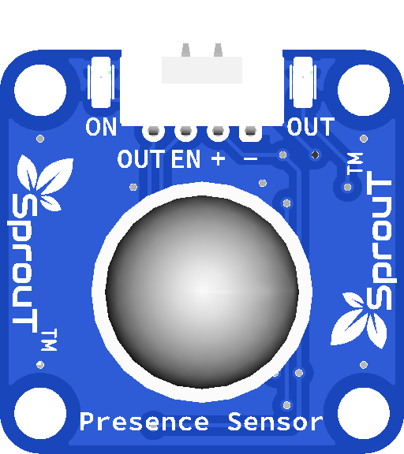

# SprouT Presence Sensor

## Overview

<p align="center">
  
</p>

The **SprouT Presence Sensor** is an input sensor module used to detect motion or human presence using a PIR sensor.

PIR stands for **Passive Infrared Sensor**. It detects changes in infrared radiation, usually from warm objects such as humans or animals.

In SprouT documentation, this module is called the **Presence Sensor** to make it easier for beginners to understand.

Common project examples include:

- Motion detection alarm
- Automatic light system
- Smart room detection
- Security monitoring project
- Automatic fan trigger
- Visitor detection
- Classroom automation
- Energy-saving lighting system

---

## Description

The Presence Sensor detects movement from warm objects.

It does not send infrared light by itself. Instead, it passively detects changes in infrared energy from the environment.

When a person moves in front of the sensor, the PIR element detects a change and sends a signal through the `OUT` pin.

Basic behavior:

```text
No movement detected  → OUT = LOW
Movement detected     → OUT = HIGH
```

However, the output behavior may depend on the module version and baseboard design, so it is recommended to test the sensor using the Serial Monitor.

---

## Important Note

Although this module is called a **Presence Sensor**, a PIR sensor mainly detects **motion**.

This means:

```text
Person moving      → detected
Person standing still for a long time → may not always be detected
```

For beginner projects, it is still suitable for detecting people entering, moving, or passing through an area.

---

## Main Features

- Detects motion or human presence
- Uses passive infrared sensing
- Simple output signal
- Easy to connect with SprouT baseboard
- Suitable for Arduino and ESP32 projects
- Can trigger LED, buzzer, relay, or LCD message
- Useful for automation and security projects
- Low power consumption

---

## Typical Specifications

| Item | Description |
|---|---|
| Sensor Type | PIR motion sensor |
| Detection Type | Infrared motion detection |
| Output Type | Digital signal |
| Pins | OUT, EN, +, - |
| Operating Voltage | Usually 3.3V or 5V depending on module/baseboard |
| Common Output | HIGH when motion is detected |
| Common Use | Motion detection, presence detection, automation |
| Compatible Boards | Arduino, ESP32, SprouT MakerBox baseboard |

> The detection range and delay depend on the PIR sensor module and surrounding environment.

---

## Pinout

The SprouT Presence Sensor has the following pins.

| Sensor Pin | Function | Description |
|---|---|---|
| **OUT** | Signal Output | Sends motion detection signal to the microcontroller |
| **EN** | Enable | Enables or controls the sensor module depending on baseboard design |
| **+** | Power | Connects to VCC from the baseboard |
| **-** | Ground | Connects to GND from the baseboard |

---

## About the EN Pin

The `EN` pin is usually used as an enable or control pin.

For normal beginner plug-and-play use with the **SprouT MakerBox baseboard**, the EN pin is handled by the baseboard connection.

If connecting manually:

- Connect `+` to the correct voltage
- Connect `-` to GND
- Connect `OUT` to a digital input pin
- Leave `EN` according to your module/baseboard design, or connect it as required by the SprouT baseboard documentation

If unsure, use the dedicated SprouT port instead of manual wiring.

---

## Plug and Play with SprouT Baseboard

The SprouT MakerBox baseboard has input ports for sensors like the Presence Sensor.

### Step 1: Turn off the power

Before connecting the sensor, turn off the baseboard power.

This helps prevent accidental short circuits or wrong pin connection.

---

### Step 2: Locate the sensor input port

Find the correct input port on the SprouT baseboard.

The Presence Sensor uses a digital signal, so it should be connected to a digital input port.

The port may contain labels such as:

```text
OUT
EN
+
-
```

or:

```text
Signal
Enable
VCC
GND
```

---

### Step 3: Connect the Presence Sensor

Connect the sensor to the baseboard.

| Presence Sensor | SprouT Baseboard |
|---|---|
| OUT | Digital Signal Pin |
| EN | Enable Pin |
| + | VCC / + |
| - | GND / - |

Make sure the module is not plugged in backwards.

---

### Step 4: Power on the baseboard

After checking the connection, power on the baseboard.

---

### Step 5: Wait for sensor warm-up

PIR sensors usually need a short warm-up time after power is turned on.

Recommended waiting time:

```text
30 seconds to 60 seconds
```

During this time, the reading may be unstable.

---

### Step 6: Test motion detection

Move your hand or body in front of the sensor.

The `OUT` value should change when motion is detected.

---

## How It Works

The Presence Sensor detects infrared changes from warm moving objects.

Simple flow:

```text
Person moves in front of sensor
        ↓
PIR element detects infrared change
        ↓
Sensor changes OUT signal
        ↓
Microcontroller reads HIGH or LOW
        ↓
Program triggers LED, buzzer, relay, or message
```

Example logic:

```text
OUT = HIGH → Motion detected
OUT = LOW  → No motion
```

If your module works in the opposite way, reverse the condition in the code.

---

## Arduino Example

This example reads the Presence Sensor and displays the result on the Serial Monitor.

```cpp
/*
  SprouT Presence Sensor Test
  Sensor: PIR Sensor
  Board: Arduino Uno / Nano

  Connection:
  Presence Sensor OUT -> D2
  Presence Sensor +   -> 5V
  Presence Sensor -   -> GND

  If using SprouT baseboard:
  Plug the sensor into the Presence Sensor input port.
*/

#define PIR_SENSOR_PIN 2

void setup() {
  Serial.begin(9600);
  pinMode(PIR_SENSOR_PIN, INPUT);

  Serial.println("SprouT Presence Sensor Ready");
  Serial.println("Waiting for PIR warm-up...");
  delay(30000);
  Serial.println("Sensor Ready");
}

void loop() {
  int sensorState = digitalRead(PIR_SENSOR_PIN);

  Serial.print("Presence Sensor State: ");
  Serial.print(sensorState);

  if (sensorState == HIGH) {
    Serial.println(" | Motion Detected");
  } else {
    Serial.println(" | No Motion");
  }

  delay(300);
}
```

---

## ESP32 Example

```cpp
/*
  SprouT Presence Sensor Test
  Sensor: PIR Sensor
  Board: ESP32

  Connection:
  Presence Sensor OUT -> GPIO 4
  Presence Sensor +   -> 3.3V or suitable baseboard VCC
  Presence Sensor -   -> GND
*/

#define PIR_SENSOR_PIN 4

void setup() {
  Serial.begin(115200);
  pinMode(PIR_SENSOR_PIN, INPUT);

  Serial.println("ESP32 Presence Sensor Ready");
  Serial.println("Waiting for PIR warm-up...");
  delay(30000);
  Serial.println("Sensor Ready");
}

void loop() {
  int sensorState = digitalRead(PIR_SENSOR_PIN);

  Serial.print("Presence Sensor State: ");
  Serial.print(sensorState);

  if (sensorState == HIGH) {
    Serial.println(" | Motion Detected");
  } else {
    Serial.println(" | No Motion");
  }

  delay(300);
}
```

---

## Example Application: Motion Detection LED

This example turns on an LED when motion is detected.

```cpp
#define PIR_SENSOR_PIN 2
#define LED_PIN 8

void setup() {
  pinMode(PIR_SENSOR_PIN, INPUT);
  pinMode(LED_PIN, OUTPUT);

  Serial.begin(9600);
  Serial.println("Motion LED System Ready");

  delay(30000);
}

void loop() {
  int motion = digitalRead(PIR_SENSOR_PIN);

  if (motion == HIGH) {
    digitalWrite(LED_PIN, HIGH);
    Serial.println("Motion Detected - LED ON");
  } else {
    digitalWrite(LED_PIN, LOW);
    Serial.println("No Motion - LED OFF");
  }

  delay(300);
}
```

---

## Example Application: Motion Alarm with Buzzer

```cpp
#define PIR_SENSOR_PIN 2
#define BUZZER_PIN 8

void setup() {
  pinMode(PIR_SENSOR_PIN, INPUT);
  pinMode(BUZZER_PIN, OUTPUT);

  Serial.begin(9600);
  Serial.println("Motion Alarm Ready");

  delay(30000);
}

void loop() {
  int motion = digitalRead(PIR_SENSOR_PIN);

  if (motion == HIGH) {
    digitalWrite(BUZZER_PIN, HIGH);
    Serial.println("Motion Detected - Alarm ON");
  } else {
    digitalWrite(BUZZER_PIN, LOW);
    Serial.println("No Motion - Alarm OFF");
  }

  delay(300);
}
```

---

## Calibration and Testing Guide

To get better results:

1. Power on the sensor.
2. Wait 30 to 60 seconds.
3. Keep the sensor still.
4. Move your hand in front of the sensor.
5. Check the Serial Monitor.
6. Adjust your code logic if the output is reversed.

Example result:

```text
No motion: 0
Motion: 1
```

If your result is:

```text
No motion: 1
Motion: 0
```

Then reverse the code condition.

---

## Applications

- Motion detection alarm
- Automatic room light
- Smart toilet light
- Human movement detection
- Security system
- Doorway detection
- Energy-saving system
- Smart classroom project
- Visitor detection system

---

## Troubleshooting

### Problem: Sensor always detects motion

Possible causes:

- Sensor is still warming up
- Sensor is facing moving objects
- Sensor is near a fan or air conditioner
- Sensor is near heat source
- Power supply is unstable

Solution:

- Wait 30 to 60 seconds after powering on
- Move the sensor away from fans or heat sources
- Keep the sensor stable
- Use a stable power supply

---

### Problem: Sensor never detects motion

Possible causes:

- Wrong wiring
- OUT pin connected to wrong input
- Sensor not powered
- Person is too far from sensor
- Sensor angle is not correct

Solution:

- Check `OUT`, `+`, and `-` connections
- Move closer to the sensor
- Try moving across the sensor view instead of directly toward it
- Check the correct pin number in the code

---

### Problem: Detection is delayed

PIR sensors may have a built-in delay.

This is normal.

Some modules hold the output HIGH for a short time after detecting motion.

---

### Problem: Sensor detects movement even when no one is there

Possible causes:

- Moving curtains
- Fan airflow
- Sunlight changes
- Hot objects
- Pets
- Reflections from windows

Solution:

- Place the sensor away from windows
- Avoid pointing it at fans or curtains
- Avoid direct sunlight
- Adjust the sensor position

---

## FAQ

### Is the Presence Sensor analog or digital?

It is normally used as a digital sensor.

---

### Does it detect a person who is not moving?

Not always. PIR sensors are better at detecting movement, not perfectly still objects.

---

### Why must I wait after powering it on?

The PIR sensor needs time to stabilize after power-up.

---

### Can I use it with ESP32?

Yes. Connect `OUT` to a suitable GPIO input pin.

---

### Can it detect animals?

Yes, if the animal is warm and moving within the sensor range.

---

### Can I use it for a security alarm?

Yes, for learning and prototype projects. For real security systems, use certified equipment.

---

## Safety Notes

- Do not reverse the `+` and `-` pins.
- Do not connect the sensor to a voltage higher than supported.
- Turn off power before connecting or removing the module.
- Do not use this as a certified safety or security device.

---

## See Also

- [SprouT Sound Sensor](Sound-Sensor.md)
- [SprouT LED](../output-components/LED.md)
- [SprouT Buzzer](../output-components/Buzzer.md)
- [SprouT Relay](../output-components/Relay.md)

---

*Last Updated: July 2026*