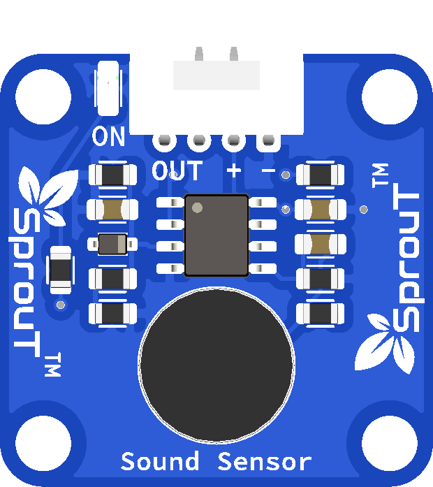

# SprouT Sound Sensor

## Overview

<p align="center">
  
</p>

The **SprouT Sound Sensor** is an input sensor module used to detect sound level or sudden sound events.

It uses a small microphone to detect sound from the surrounding environment. The module can be used to detect claps, knocks, loud noises, or general sound activity.

Common project examples include:

- Clap switch
- Sound activated LED
- Noise detection system
- Smart alarm trigger
- Sound level monitor
- Classroom noise indicator
- Knock detection project
- Voice activity detection experiment

---

## Description

The Sound Sensor detects sound vibration in the air using a microphone.

When sound reaches the microphone, the module converts it into an electrical signal. The microcontroller can then read this signal using the `OUT` pin.

Depending on the module design, the output may be:

| Output Type | Description |
|---|---|
| Analog Output | Gives changing values based on sound level |
| Digital Output | Gives HIGH or LOW when sound passes a threshold |

For beginner projects, the sensor is commonly used to detect whether a sound is loud enough to trigger an action.

Example:

```text
Quiet room       → low or stable reading
Clap / knock     → sudden change in reading
Loud environment → higher or more active reading
```

---

## Important Note

The Sound Sensor is not a voice recognition module.

It cannot understand words such as:

```text
Turn on light
Open door
Start motor
```

It only detects sound intensity or sound activity.

---

## Main Features

- Detects sound or noise
- Uses onboard microphone
- Simple 3-pin connection
- Easy to use with Arduino and ESP32
- Plug-and-play with SprouT baseboard
- Can trigger LED, buzzer, relay, or counter
- Suitable for clap switch projects
- Useful for noise monitoring projects

---

## Typical Specifications

| Item | Description |
|---|---|
| Sensor Type | Microphone sound sensor |
| Output Type | Analog or digital depending on module/baseboard |
| Pins | OUT, +, - |
| Operating Voltage | Usually 3.3V or 5V depending on module/baseboard |
| Detection | Sound level / sound activity |
| Common Use | Clap detection, noise detection, sound trigger |
| Compatible Boards | Arduino, ESP32, SprouT MakerBox baseboard |

> The sensitivity depends on the sensor design, microphone quality, distance from sound source, and surrounding noise.

---

## Pinout

The SprouT Sound Sensor has 3 main pins.

| Sensor Pin | Function | Description |
|---|---|---|
| **OUT** | Signal Output | Sends sound signal to the microcontroller |
| **+** | Power | Connects to VCC from the baseboard |
| **-** | Ground | Connects to GND from the baseboard |

---

## Plug and Play with SprouT Baseboard

The SprouT MakerBox baseboard has input ports for sensors like the Sound Sensor.

### Step 1: Turn off the power

Before connecting the Sound Sensor, turn off the baseboard power.

This prevents accidental wrong connection or short circuit.

---

### Step 2: Locate the sensor input port

Find a sensor input port on the SprouT baseboard.

If you want to measure sound level as a value, use an analog input port.

If you want to detect sound as ON/OFF, use a digital input port if supported.

The port usually contains:

```text
OUT
+
-
```

or:

```text
Signal
VCC
GND
```

---

### Step 3: Connect the Sound Sensor

Connect the sensor to the baseboard.

| Sound Sensor | SprouT Baseboard |
|---|---|
| OUT | Signal Pin |
| + | VCC / + |
| - | GND / - |

Make sure the module is not plugged in backwards.

---

### Step 4: Power on the baseboard

After checking the connection, power on the baseboard.

---

### Step 5: Test the sound reading

Open the Serial Monitor.

Clap your hands or make a sound near the sensor.

The sensor reading should change when sound is detected.

---

## How It Works

The Sound Sensor uses a microphone to detect air vibration.

Simple flow:

```text
Sound reaches microphone
        ↓
Microphone converts sound into signal
        ↓
Module processes the signal
        ↓
OUT pin changes
        ↓
Microcontroller reads the signal
        ↓
Program triggers an action
```

Example uses:

```text
Clap detected → turn LED on
Loud noise    → activate buzzer
Knock sound   → increase counter
```

---

## Arduino Example: Analog Reading

Use this example if the Sound Sensor is connected to an analog input.

```cpp
/*
  SprouT Sound Sensor Test
  Board: Arduino Uno / Nano

  Connection:
  Sound Sensor OUT -> A0
  Sound Sensor +   -> 5V
  Sound Sensor -   -> GND
*/

#define SOUND_SENSOR_PIN A0

void setup() {
  Serial.begin(9600);
  Serial.println("SprouT Sound Sensor Ready");
}

void loop() {
  int soundValue = analogRead(SOUND_SENSOR_PIN);

  Serial.print("Sound Sensor Value: ");
  Serial.println(soundValue);

  delay(100);
}
```

---

## Arduino Example: Sound Trigger

This example turns on an LED when the sound value is above a threshold.

```cpp
#define SOUND_SENSOR_PIN A0
#define LED_PIN 8

int soundThreshold = 600;

void setup() {
  pinMode(LED_PIN, OUTPUT);
  Serial.begin(9600);

  Serial.println("Sound Trigger Ready");
}

void loop() {
  int soundValue = analogRead(SOUND_SENSOR_PIN);

  Serial.print("Sound Value: ");
  Serial.println(soundValue);

  if (soundValue > soundThreshold) {
    digitalWrite(LED_PIN, HIGH);
    Serial.println("Sound Detected - LED ON");
  } else {
    digitalWrite(LED_PIN, LOW);
  }

  delay(100);
}
```

---

## ESP32 Example

```cpp
/*
  SprouT Sound Sensor Test
  Board: ESP32

  Connection:
  Sound Sensor OUT -> GPIO34
  Sound Sensor +   -> 3.3V or suitable baseboard VCC
  Sound Sensor -   -> GND
*/

#define SOUND_SENSOR_PIN 34

void setup() {
  Serial.begin(115200);
  Serial.println("ESP32 Sound Sensor Ready");
}

void loop() {
  int soundValue = analogRead(SOUND_SENSOR_PIN);

  Serial.print("Sound Sensor Value: ");
  Serial.println(soundValue);

  delay(100);
}
```

---

## Example Application: Clap Switch

This example toggles an LED when a loud clap is detected.

```cpp
#define SOUND_SENSOR_PIN A0
#define LED_PIN 8

int soundThreshold = 600;
bool ledState = false;
unsigned long lastClapTime = 0;
unsigned long debounceDelay = 500;

void setup() {
  pinMode(LED_PIN, OUTPUT);
  Serial.begin(9600);

  Serial.println("Clap Switch Ready");
}

void loop() {
  int soundValue = analogRead(SOUND_SENSOR_PIN);

  if (soundValue > soundThreshold) {
    unsigned long currentTime = millis();

    if (currentTime - lastClapTime > debounceDelay) {
      ledState = !ledState;
      digitalWrite(LED_PIN, ledState);

      Serial.print("Clap Detected - LED: ");
      Serial.println(ledState ? "ON" : "OFF");

      lastClapTime = currentTime;
    }
  }

  delay(20);
}
```

---

## Example Application: Noise Level Indicator

This example shows a simple sound status in the Serial Monitor.

```cpp
#define SOUND_SENSOR_PIN A0

void setup() {
  Serial.begin(9600);
}

void loop() {
  int soundValue = analogRead(SOUND_SENSOR_PIN);

  Serial.print("Sound Value: ");
  Serial.print(soundValue);

  if (soundValue < 300) {
    Serial.println(" | Quiet");
  } 
  else if (soundValue < 600) {
    Serial.println(" | Normal");
  } 
  else {
    Serial.println(" | Loud");
  }

  delay(200);
}
```

---

## Calibration Guide

The Sound Sensor value depends on the environment.

To set a good threshold:

1. Open the Serial Monitor.
2. Keep the room quiet.
3. Record the normal reading.
4. Clap near the sensor.
5. Record the clap reading.
6. Choose a threshold between the quiet and clap value.

Example:

```text
Quiet room reading: around 250
Clap reading: around 750

Suggested threshold: 600
```

Then use:

```cpp
int soundThreshold = 600;
```

For ESP32, the value range is usually larger:

```text
Arduino Uno/Nano: 0 to 1023
ESP32: 0 to 4095
```

So ESP32 thresholds need to be adjusted.

---

## Applications

- Clap switch
- Sound activated LED
- Knock detection
- Noise level monitor
- Classroom noise indicator
- Alarm trigger
- Smart home project
- Robot sound response
- Data logging project
- IoT noise monitoring

---

## Troubleshooting

### Problem: Sensor value does not change

Possible causes:

- OUT pin not connected
- Wrong input pin selected
- Sensor not powered
- Sound is too weak
- Wrong code used

Solution:

- Check `OUT`, `+`, and `-`
- Make sure the code uses the correct pin
- Clap near the sensor
- Try another input pin
- Open Serial Monitor to check raw values

---

### Problem: Sensor always triggers

Possible causes:

- Threshold is too low
- Environment is too noisy
- Sensor is near a fan or motor
- Power supply noise
- Module sensitivity is too high

Solution:

- Increase the threshold value
- Move the sensor away from noisy parts
- Use stable power
- Add debounce delay in the code

---

### Problem: Clap switch toggles many times

Possible causes:

- One clap creates multiple sound peaks
- No debounce delay
- Threshold is too sensitive

Solution:

Use a debounce timer.

Example:

```cpp
unsigned long debounceDelay = 500;
```

This prevents the switch from toggling too many times from one clap.

---

### Problem: Reading is unstable

Possible causes:

- Background noise
- Loose wire
- Long cable
- Electrical noise from motors or relays

Solution:

- Use shorter wires
- Keep the sensor away from motors
- Use averaging
- Use a higher threshold
- Test in a quieter environment

---

## FAQ

### Is the Sound Sensor analog or digital?

It depends on the module/baseboard design. It can be used as analog for sound level or digital for sound detection.

---

### Can it understand voice commands?

No. It only detects sound level or sound activity.

---

### Can it detect claps?

Yes. A clap switch is one of the most common projects using this sensor.

---

### Can I use it with ESP32?

Yes. For analog reading, connect `OUT` to an ADC-capable pin such as GPIO34, GPIO35, GPIO32, or GPIO33.

---

### Can it measure exact decibels?

Not accurately by default. It can detect relative loudness, but it is not a calibrated decibel meter.

---

### Why does it trigger when a motor runs?

Motors create sound and electrical noise, which may affect the sensor reading.

---

## Safety Notes

- Do not reverse the `+` and `-` pins.
- Do not connect the sensor to a voltage higher than supported.
- Turn off power before connecting or removing the module.
- Do not use this as a certified sound level meter.

---

## See Also

- [SprouT Presence Sensor](Presence-Sensor.md)
- [SprouT LED](../output-components/LED.md)
- [SprouT Buzzer](../output-components/Buzzer.md)
- [SprouT Relay](../output-components/Relay.md)

---

*Last Updated: July 2026*