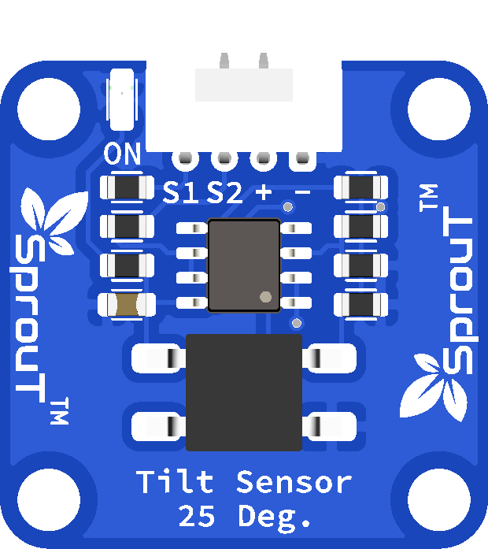

# SprouT Tilt Sensor

## Overview

<p align="center">
  
</p>

The **SprouT Tilt Sensor** is an input sensor module used to detect whether an object has been tilted or moved from its normal position.

This sensor is useful for detecting changes in orientation, angle, movement, or position. It can be used in simple alarm systems, safety systems, movement detection projects, and interactive electronics projects.

Common project examples include:

- Tilt alarm
- Anti-theft box alarm
- Object movement detector
- Balance detection project
- Position detection system
- Interactive game controller
- Safety cut-off trigger
- Robot orientation detection

---

## Description

The Tilt Sensor detects changes in angle or orientation.

When the module is tilted, the internal sensing element changes its electrical state. The microcontroller can read this state through the signal pin.

The SprouT Tilt Sensor module is labeled with:

```text
S1
S2
+
-
```

Depending on the module design, `S1` and `S2` may be used as signal outputs for detecting tilt state or tilt direction.

For basic beginner use, one signal pin can be connected to a digital input pin and read as either `HIGH` or `LOW`.

Example concept:

```text
Normal position → output state 1
Tilted position → output state changes
```

The exact `HIGH` or `LOW` behavior may depend on the module and baseboard design, so always test the sensor using the Serial Monitor first.

---

## Main Features

- Detects tilt or change in position
- Simple digital input sensor
- Can be used for movement detection
- Easy to use with Arduino and ESP32
- Plug-and-play with SprouT baseboard
- Suitable for beginner projects
- Can trigger LED, buzzer, relay, or alarm
- Useful for safety and anti-theft projects

---

## Typical Specifications

| Item | Description |
|---|---|
| Sensor Type | Tilt / angle detection sensor |
| Output Type | Digital signal |
| Pins | S1, S2, +, - |
| Operating Voltage | Usually 3.3V or 5V depending on module/baseboard |
| Detection | Tilt, angle change, movement |
| Common Use | Tilt alarm, movement detection, position sensing |
| Compatible Boards | Arduino, ESP32, SprouT MakerBox baseboard |

> The exact trigger angle may depend on the module version. This SprouT module is labeled as a **25° tilt sensor**, meaning it is intended to detect tilt around that angle range.

---

## Pinout

The SprouT Tilt Sensor has 4 pins.

| Sensor Pin | Function | Description |
|---|---|---|
| **S1** | Signal 1 | First tilt signal output |
| **S2** | Signal 2 | Second tilt signal output |
| **+** | Power | Connects to VCC from the baseboard |
| **-** | Ground | Connects to GND from the baseboard |

---

## Plug and Play with SprouT Baseboard

The SprouT MakerBox baseboard has input ports for sensors like the Tilt Sensor.

### Step 1: Turn off the power

Before connecting the Tilt Sensor, turn off the baseboard power.

This prevents wrong connection and accidental short circuits.

---

### Step 2: Locate the input port

Find the correct input port on the SprouT baseboard.

The Tilt Sensor uses digital signals, so it should be connected to a digital input port.

The port may contain labels such as:

```text
S1
S2
+
-
```

or:

```text
Signal 1
Signal 2
VCC
GND
```

---

### Step 3: Connect the Tilt Sensor

Connect the sensor to the baseboard.

| Tilt Sensor | SprouT Baseboard |
|---|---|
| S1 | Digital Signal Pin 1 |
| S2 | Digital Signal Pin 2 |
| + | VCC / + |
| - | GND / - |

Make sure the module is not connected backwards.

---

### Step 4: Power on the baseboard

After checking the connection, power on the baseboard.

---

### Step 5: Test the tilt reading

Open the Serial Monitor.

Slowly tilt the sensor and observe the values from `S1` and `S2`.

The output should change when the module is tilted.

---

## How It Works

The Tilt Sensor changes its signal output when the module changes angle.

Simple flow:

```text
Sensor is in normal position
        ↓
Microcontroller reads normal output
        ↓
Sensor is tilted
        ↓
Internal switch/sensor changes state
        ↓
Microcontroller detects HIGH or LOW
        ↓
Program triggers LED, buzzer, relay, or alarm
```

Example logic:

```text
Tilt detected → turn on buzzer
No tilt       → buzzer off
```

---

## Arduino Example: Read One Signal Pin

This example reads `S1` only.

```cpp
/*
  SprouT Tilt Sensor Test
  Board: Arduino Uno / Nano

  Connection:
  Tilt Sensor S1 -> D2
  Tilt Sensor +  -> 5V
  Tilt Sensor -  -> GND
*/

#define TILT_SENSOR_PIN 2

void setup() {
  Serial.begin(9600);
  pinMode(TILT_SENSOR_PIN, INPUT);

  Serial.println("SprouT Tilt Sensor Ready");
}

void loop() {
  int tiltState = digitalRead(TILT_SENSOR_PIN);

  Serial.print("Tilt Sensor State: ");
  Serial.print(tiltState);

  if (tiltState == HIGH) {
    Serial.println(" | Tilt Detected");
  } else {
    Serial.println(" | Normal Position");
  }

  delay(300);
}
```

> If your result is reversed, change `tiltState == HIGH` to `tiltState == LOW`.

---

## Arduino Example: Read S1 and S2

This example reads both `S1` and `S2`.

```cpp
/*
  SprouT Tilt Sensor Test
  Board: Arduino Uno / Nano

  Connection:
  Tilt Sensor S1 -> D2
  Tilt Sensor S2 -> D3
  Tilt Sensor +  -> 5V
  Tilt Sensor -  -> GND
*/

#define TILT_S1_PIN 2
#define TILT_S2_PIN 3

void setup() {
  Serial.begin(9600);

  pinMode(TILT_S1_PIN, INPUT);
  pinMode(TILT_S2_PIN, INPUT);

  Serial.println("SprouT Tilt Sensor S1/S2 Test Ready");
}

void loop() {
  int s1State = digitalRead(TILT_S1_PIN);
  int s2State = digitalRead(TILT_S2_PIN);

  Serial.print("S1: ");
  Serial.print(s1State);

  Serial.print(" | S2: ");
  Serial.println(s2State);

  delay(300);
}
```

---

## ESP32 Example

```cpp
/*
  SprouT Tilt Sensor Test
  Board: ESP32

  Connection:
  Tilt Sensor S1 -> GPIO 4
  Tilt Sensor +  -> 3.3V or suitable baseboard VCC
  Tilt Sensor -  -> GND
*/

#define TILT_SENSOR_PIN 4

void setup() {
  Serial.begin(115200);
  pinMode(TILT_SENSOR_PIN, INPUT);

  Serial.println("ESP32 Tilt Sensor Ready");
}

void loop() {
  int tiltState = digitalRead(TILT_SENSOR_PIN);

  Serial.print("Tilt Sensor State: ");
  Serial.print(tiltState);

  if (tiltState == HIGH) {
    Serial.println(" | Tilt Detected");
  } else {
    Serial.println(" | Normal Position");
  }

  delay(300);
}
```

---

## Example Application: Tilt Alarm with Buzzer

This example turns on a buzzer when tilt is detected.

```cpp
#define TILT_SENSOR_PIN 2
#define BUZZER_PIN 8

void setup() {
  pinMode(TILT_SENSOR_PIN, INPUT);
  pinMode(BUZZER_PIN, OUTPUT);

  Serial.begin(9600);
  Serial.println("Tilt Alarm Ready");
}

void loop() {
  int tiltState = digitalRead(TILT_SENSOR_PIN);

  if (tiltState == HIGH) {
    digitalWrite(BUZZER_PIN, HIGH);
    Serial.println("Tilt Detected - Alarm ON");
  } else {
    digitalWrite(BUZZER_PIN, LOW);
    Serial.println("Normal Position - Alarm OFF");
  }

  delay(200);
}
```

---

## Example Application: Movement Counter

This example counts how many times the sensor detects a tilt event.

```cpp
#define TILT_SENSOR_PIN 2

int tiltCount = 0;
bool previousTiltState = false;

void setup() {
  pinMode(TILT_SENSOR_PIN, INPUT);
  Serial.begin(9600);

  Serial.println("Tilt Counter Ready");
}

void loop() {
  int tiltState = digitalRead(TILT_SENSOR_PIN);

  if (tiltState == HIGH && previousTiltState == false) {
    tiltCount++;

    Serial.print("Tilt Count: ");
    Serial.println(tiltCount);

    previousTiltState = true;
  }

  if (tiltState == LOW) {
    previousTiltState = false;
  }

  delay(50);
}
```

---

## Calibration and Testing Guide

To test the Tilt Sensor properly:

1. Connect the sensor to the baseboard.
2. Open the Serial Monitor.
3. Keep the sensor flat.
4. Record the normal value.
5. Tilt the sensor slowly.
6. Record the tilted value.
7. Adjust your code logic if the output is reversed.

Example result:

```text
Normal position: 0
Tilted position: 1
```

If your result is:

```text
Normal position: 1
Tilted position: 0
```

Reverse the condition in the code.

---

## Applications

- Tilt alarm
- Anti-theft box alarm
- Safety cut-off system
- Movement detection
- Robot orientation detection
- Game controller input
- Interactive learning projects
- Door or lid position detection
- Fall detection prototype

---

## Troubleshooting

### Problem: Sensor always shows tilted

Possible causes:

- Sensor is not placed flat
- Output logic is reversed
- Wrong signal pin selected
- Loose connection
- Sensor is mounted at an angle

Solution:

- Place the sensor on a flat surface
- Check the Serial Monitor reading
- Try reversing the code condition
- Check the `S1`, `S2`, `+`, and `-` connections

---

### Problem: Sensor never detects tilt

Possible causes:

- Wrong wiring
- Signal pin connected to wrong input
- Sensor is not tilted enough
- Wrong pin number in code
- Sensor is damaged

Solution:

- Recheck the wiring
- Tilt the sensor more clearly
- Try using the other signal pin
- Confirm the correct digital pin in the code

---

### Problem: Reading changes too quickly

Tilt sensors may bounce when the internal contact changes state.

Solution:

Use a small delay or debounce method.

Example:

```cpp
delay(50);
```

For better detection, use a debounce timer in code.

---

### Problem: Output is reversed

Some modules output `HIGH` when tilted, while others output `LOW`.

Solution:

Change:

```cpp
if (tiltState == HIGH)
```

to:

```cpp
if (tiltState == LOW)
```

---

## FAQ

### Is the Tilt Sensor analog or digital?

It is normally used as a digital sensor.

---

### What is the difference between S1 and S2?

`S1` and `S2` are signal outputs. Depending on the module design, they may represent different tilt states or directions.

---

### Can I use only S1?

Yes. For simple projects, you can use only one signal pin.

---

### Can I use it with ESP32?

Yes. Connect the signal pin to a suitable GPIO input pin.

---

### Can it measure exact angle?

No. This sensor detects tilt state, not exact angle. For exact angle measurement, use an accelerometer or gyroscope.

---

### Why does the reading flicker?

The internal tilt mechanism may bounce during movement. Add debounce or delay in the code.

---

## Safety Notes

- Do not reverse the `+` and `-` pins.
- Do not connect the sensor to a voltage higher than supported.
- Turn off power before connecting or removing the module.
- Do not use this sensor as a certified safety device.

---

## See Also

- [SprouT Ultrasonic Sensor](Ultrasonic-Sensor.md)
- [SprouT LED](../output-components/LED.md)
- [SprouT Buzzer](../output-components/Buzzer.md)
- [SprouT Relay](../output-components/Relay.md)

---

*Last Updated: July 2026*  