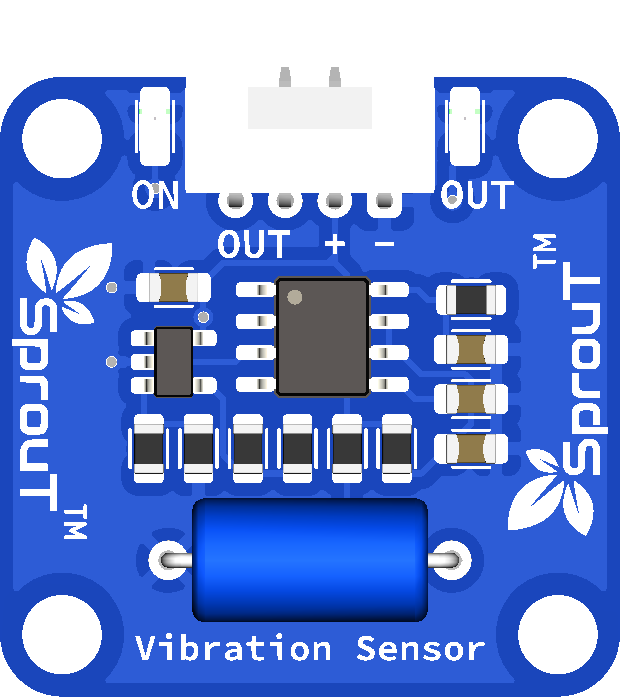

# SprouT Vibration Sensor

## Overview

<p align="center">
  
</p>

The **SprouT Vibration Sensor** is an input sensor module used to detect vibration, shaking, knocking, impact, or movement.

It is useful for projects that need to detect when an object is moved, touched, knocked, dropped, shaken, or disturbed.

Common project examples include:

- Knock detection system
- Anti-theft alarm
- Vibration alarm
- Earthquake model project
- Machine vibration monitor
- Object movement detector
- Smart box security system
- Impact detection project
- Door or window vibration alarm

---

## Description

The Vibration Sensor detects physical vibration or movement.

When the sensor experiences vibration, the internal sensing element changes state. The module then sends a signal through the `OUT` pin.

Basic behavior:

```text
No vibration detected  → OUT stays in normal state
Vibration detected     → OUT signal changes
```

Depending on the module design, the output may become `HIGH` or `LOW` when vibration is detected.

For many vibration modules:

```text
Vibration detected     → OUT = HIGH
No vibration detected  → OUT = LOW
```

However, this can be different depending on the module or baseboard circuit, so it is recommended to test the sensor using the Serial Monitor first.

---

## Main Features

- Detects vibration or shaking
- Detects knocks and impact
- Simple 3-pin connection
- Easy to use with Arduino and ESP32
- Plug-and-play with SprouT baseboard
- Suitable for beginner security and alarm projects
- Can trigger LED, buzzer, relay, or counter
- Useful for movement detection projects

---

## Typical Specifications

| Item | Description |
|---|---|
| Sensor Type | Vibration / shock detection sensor |
| Output Type | Digital signal |
| Pins | OUT, +, - |
| Operating Voltage | Usually 3.3V or 5V depending on module/baseboard |
| Detection | Vibration, shaking, knock, impact |
| Common Use | Alarm, movement detection, knock detection |
| Compatible Boards | Arduino, ESP32, SprouT MakerBox baseboard |

> The sensitivity depends on the sensor module, mounting position, vibration strength, and the object where the sensor is attached.

---

## Pinout

The SprouT Vibration Sensor has 3 main pins.

| Sensor Pin | Function | Description |
|---|---|---|
| **OUT** | Signal Output | Sends vibration detection signal to the microcontroller |
| **+** | Power | Connects to VCC from the baseboard |
| **-** | Ground | Connects to GND from the baseboard |

---

## Plug and Play with SprouT Baseboard

The SprouT MakerBox baseboard has input ports for sensors like the Vibration Sensor.

### Step 1: Turn off the power

Before connecting the Vibration Sensor, turn off the baseboard power.

This prevents accidental short circuits or wrong connection.

---

### Step 2: Locate the sensor input port

Find a digital input port on the SprouT baseboard.

The Vibration Sensor normally uses a digital signal, so it should be connected to a digital input port.

The port usually contains:

```text
OUT
+
-
```

or:

```text
Signal
VCC
GND
```

---

### Step 3: Connect the Vibration Sensor

Connect the sensor to the baseboard.

| Vibration Sensor | SprouT Baseboard |
|---|---|
| OUT | Digital Signal Pin |
| + | VCC / + |
| - | GND / - |

Make sure the module is not plugged in backwards.

---

### Step 4: Power on the baseboard

After checking the connection, power on the baseboard.

---

### Step 5: Test the sensor

Open the Serial Monitor.

Tap the table, shake the module gently, or knock near the sensor.

The sensor value should change when vibration is detected.

---

## How It Works

The Vibration Sensor detects physical movement or vibration.

Simple flow:

```text
Sensor is stable
        ↓
Microcontroller reads normal output
        ↓
Sensor is shaken or knocked
        ↓
Internal vibration element changes state
        ↓
OUT pin changes
        ↓
Microcontroller detects vibration
        ↓
Program triggers LED, buzzer, relay, or counter
```

Example logic:

```text
Vibration detected → turn on buzzer
No vibration       → buzzer off
```

---

## Arduino Example

This example reads the Vibration Sensor and displays the result on the Serial Monitor.

```cpp
/*
  SprouT Vibration Sensor Test
  Board: Arduino Uno / Nano

  Connection:
  Vibration Sensor OUT -> D2
  Vibration Sensor +   -> 5V
  Vibration Sensor -   -> GND
*/

#define VIBRATION_SENSOR_PIN 2

void setup() {
  Serial.begin(9600);
  pinMode(VIBRATION_SENSOR_PIN, INPUT);

  Serial.println("SprouT Vibration Sensor Ready");
}

void loop() {
  int vibrationState = digitalRead(VIBRATION_SENSOR_PIN);

  Serial.print("Vibration Sensor State: ");
  Serial.print(vibrationState);

  if (vibrationState == HIGH) {
    Serial.println(" | Vibration Detected");
  } else {
    Serial.println(" | No Vibration");
  }

  delay(200);
}
```

> If your result is reversed, change `vibrationState == HIGH` to `vibrationState == LOW`.

---

## ESP32 Example

```cpp
/*
  SprouT Vibration Sensor Test
  Board: ESP32

  Connection:
  Vibration Sensor OUT -> GPIO 4
  Vibration Sensor +   -> 3.3V or suitable baseboard VCC
  Vibration Sensor -   -> GND
*/

#define VIBRATION_SENSOR_PIN 4

void setup() {
  Serial.begin(115200);
  pinMode(VIBRATION_SENSOR_PIN, INPUT);

  Serial.println("ESP32 Vibration Sensor Ready");
}

void loop() {
  int vibrationState = digitalRead(VIBRATION_SENSOR_PIN);

  Serial.print("Vibration Sensor State: ");
  Serial.print(vibrationState);

  if (vibrationState == HIGH) {
    Serial.println(" | Vibration Detected");
  } else {
    Serial.println(" | No Vibration");
  }

  delay(200);
}
```

---

## Example Application: Vibration Alarm with Buzzer

This example turns on a buzzer when vibration is detected.

```cpp
#define VIBRATION_SENSOR_PIN 2
#define BUZZER_PIN 8

void setup() {
  pinMode(VIBRATION_SENSOR_PIN, INPUT);
  pinMode(BUZZER_PIN, OUTPUT);

  Serial.begin(9600);
  Serial.println("Vibration Alarm Ready");
}

void loop() {
  int vibrationState = digitalRead(VIBRATION_SENSOR_PIN);

  if (vibrationState == HIGH) {
    digitalWrite(BUZZER_PIN, HIGH);
    Serial.println("Vibration Detected - Alarm ON");
  } else {
    digitalWrite(BUZZER_PIN, LOW);
    Serial.println("No Vibration - Alarm OFF");
  }

  delay(100);
}
```

---

## Example Application: Vibration Counter

This example counts how many times vibration is detected.

```cpp
#define VIBRATION_SENSOR_PIN 2

int vibrationCount = 0;
bool previousState = false;

void setup() {
  pinMode(VIBRATION_SENSOR_PIN, INPUT);
  Serial.begin(9600);

  Serial.println("Vibration Counter Ready");
}

void loop() {
  int vibrationState = digitalRead(VIBRATION_SENSOR_PIN);

  if (vibrationState == HIGH && previousState == false) {
    vibrationCount++;
    previousState = true;

    Serial.print("Vibration Count: ");
    Serial.println(vibrationCount);
  }

  if (vibrationState == LOW) {
    previousState = false;
  }

  delay(50);
}
```

---

## Example Application: Anti-Theft Box Alarm

This example activates a buzzer for a few seconds when the sensor detects vibration.

```cpp
#define VIBRATION_SENSOR_PIN 2
#define BUZZER_PIN 8

unsigned long alarmStartTime = 0;
bool alarmActive = false;

void setup() {
  pinMode(VIBRATION_SENSOR_PIN, INPUT);
  pinMode(BUZZER_PIN, OUTPUT);

  Serial.begin(9600);
  Serial.println("Anti-Theft Vibration Alarm Ready");
}

void loop() {
  int vibrationState = digitalRead(VIBRATION_SENSOR_PIN);

  if (vibrationState == HIGH && alarmActive == false) {
    alarmActive = true;
    alarmStartTime = millis();

    digitalWrite(BUZZER_PIN, HIGH);
    Serial.println("Movement Detected - Alarm Triggered");
  }

  if (alarmActive == true && millis() - alarmStartTime >= 3000) {
    alarmActive = false;
    digitalWrite(BUZZER_PIN, LOW);

    Serial.println("Alarm Stopped");
  }
}
```

---

## Calibration and Testing Guide

To test the Vibration Sensor properly:

1. Connect the sensor to the baseboard.
2. Open the Serial Monitor.
3. Keep the sensor still.
4. Record the normal value.
5. Tap or shake the sensor gently.
6. Record the vibration value.
7. Adjust the code logic if the output is reversed.

Example result:

```text
No vibration: 0
Vibration: 1
```

If your result is:

```text
No vibration: 1
Vibration: 0
```

Then reverse the condition in the code.

---

## Applications

- Vibration alarm
- Knock detection
- Anti-theft box alarm
- Object movement detector
- Door or window vibration alarm
- Earthquake model project
- Impact detection
- Machine vibration monitoring
- Robot collision detection
- Smart security project

---

## Troubleshooting

### Problem: Sensor always detects vibration

Possible causes:

- Sensor is mounted on a moving surface
- Table or object is vibrating
- Wires are loose
- Output logic is reversed
- Sensor is too sensitive

Solution:

- Place the sensor on a stable surface
- Check the Serial Monitor reading
- Reverse the code logic if needed
- Secure the wires properly
- Add debounce delay in the code

---

### Problem: Sensor never detects vibration

Possible causes:

- Wrong wiring
- OUT pin connected to wrong input
- Sensor is not powered
- Vibration is too weak
- Wrong pin number in the code

Solution:

- Check `OUT`, `+`, and `-`
- Tap the sensor gently
- Try a stronger vibration
- Confirm the correct input pin in the code
- Try another digital pin

---

### Problem: Reading flickers quickly

This is normal for vibration sensors.

A vibration or knock may create many fast pulses.

Solution:

Use debounce logic or a short delay.

Example:

```cpp
delay(50);
```

For event counting, use a state-change method to avoid counting one vibration many times.

---

### Problem: Alarm triggers too easily

Possible causes:

- Threshold or logic is too sensitive
- Sensor is near a motor, fan, or moving object
- Sensor is mounted loosely

Solution:

- Move the sensor away from motors or fans
- Mount the sensor firmly
- Add software debounce
- Require multiple detections before triggering alarm

Example idea:

```text
Only trigger alarm if vibration is detected 3 times within 2 seconds.
```

---

## FAQ

### Is the Vibration Sensor analog or digital?

The SprouT Vibration Sensor is normally used as a digital sensor through the `OUT` pin.

---

### Can it measure vibration strength?

Not accurately. This module is mainly used to detect whether vibration happened or not.

---

### Can it detect a knock?

Yes. It can detect knocks, taps, and impacts.

---

### Can I use it with ESP32?

Yes. Connect `OUT` to a suitable GPIO input pin.

---

### Why does it count one shake many times?

One shake can create multiple fast pulses. Use debounce or state-change detection.

---

### Can I use it for an earthquake detector?

Yes, for educational model projects. It should not be used as a certified earthquake monitoring instrument.

---

## Safety Notes

- Do not reverse the `+` and `-` pins.
- Do not connect the sensor to a voltage higher than supported.
- Turn off power before connecting or removing the module.
- Do not use this sensor as a certified safety or security device.
- Mount the sensor firmly if it is used for movement detection.

---

## See Also

- [SprouT Tilt Sensor](Tilt-Sensor.md)
- [SprouT Presence Sensor](Presence-Sensor.md)
- [SprouT Sound Sensor](Sound-Sensor.md)
- [SprouT LED](../output-components/LED.md)
- [SprouT Buzzer](../output-components/Buzzer.md)
- [SprouT Relay](../output-components/Relay.md)

---

*Last Updated: July 2026* 