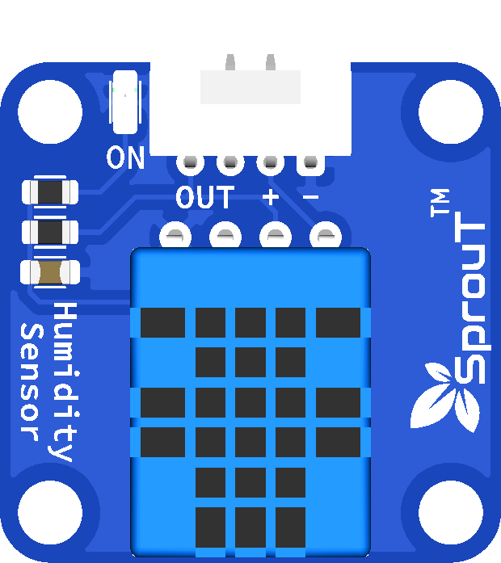

# SprouT Humidity Sensor

## Overview

<p align="center">
  
</p>

The **SprouT Humidity Sensor** is a digital sensor module used to measure humidity and temperature.

Although the actual sensor used is commonly known as **DHT11**, in SprouT documentation it is called the **Humidity Sensor** to make it easier for beginners to understand.

This module is useful for projects that need to monitor air moisture or room temperature.

Common project examples include:

- Room humidity monitor
- Smart plant monitoring system
- Weather station
- Greenhouse monitoring
- Automatic fan system
- IoT temperature and humidity dashboard
- LCD environmental display

---

## Description

The SprouT Humidity Sensor measures two values:

| Measurement | Description |
|---|---|
| Humidity | Amount of water vapor in the air |
| Temperature | Surrounding air temperature |

The sensor sends the data to the microcontroller using a **digital signal**.

Unlike analog sensors, this sensor does not use `analogRead()`.

Instead, it uses a data pin and a sensor library to read humidity and temperature values.

---

## What is Humidity?

Humidity tells us how much moisture is present in the air.

It is usually shown as relative humidity in percent.

Example:

```text
30% RH = dry air
50% RH = comfortable air
80% RH = humid air
```

RH means **Relative Humidity**.

---

## Main Features

- Measures humidity
- Measures temperature
- Uses digital communication
- Easy to use with Arduino IDE
- Suitable for beginner projects
- Can be displayed on LCD, OLED, or Serial Monitor
- Can be used for greenhouse and weather projects
- Plug-and-play with SprouT baseboard digital sensor port

---

## Typical Specifications

| Item | Description |
|---|---|
| Sensor Type | DHT11 humidity and temperature sensor |
| Output Type | Digital signal |
| Humidity Range | About 20% to 90% RH |
| Temperature Range | About 0°C to 50°C |
| Typical Accuracy | Basic educational accuracy |
| Operating Voltage | Usually 3.3V to 5V depending on module |
| Reading Speed | Around once every 1 to 2 seconds |
| Compatible Boards | Arduino, ESP32, SprouT MakerBox baseboard |

> The DHT11 is suitable for learning and simple projects. For higher accuracy, a DHT22 or SHT sensor may be used instead.

---

## Pinout

A typical humidity sensor module has 3 pins.

| Pin | Function | Description |
|---|---|---|
| VCC | Power | Connect to 3.3V or 5V |
| GND | Ground | Connect to GND |
| DATA / OUT / S | Digital Signal | Connect to a digital input pin |

Some modules may label the signal pin as:

```text
DATA
OUT
S
SIG
```

They all refer to the sensor data signal.

---

## Plug and Play with SprouT Baseboard

The SprouT MakerBox baseboard has digital input ports for sensors like the Humidity Sensor.

### Step 1: Turn off the power

Turn off the baseboard before connecting the sensor.

This prevents wrong wiring or accidental short circuits.

---

### Step 2: Locate the digital sensor port

Find a digital sensor input port on the SprouT baseboard.

The port usually contains:

```text
VCC
GND
Signal
```

or:

```text
+
-
S
```

---

### Step 3: Connect the sensor

Connect the Humidity Sensor to the baseboard.

Typical connection:

| Humidity Sensor | SprouT Baseboard |
|---|---|
| VCC / + | VCC / + |
| GND / - | GND / - |
| DATA / OUT / S | Digital Signal Pin |

---

### Step 4: Power on the baseboard

After confirming the connection, power on the baseboard.

---

### Step 5: Upload the code

The Humidity Sensor needs a DHT library to read the data.

Install the required library in Arduino IDE before uploading the code.

---

## Required Arduino Library

Install the following libraries in Arduino IDE:

```text
DHT sensor library by Adafruit
Adafruit Unified Sensor
```

### Installation steps

1. Open Arduino IDE.
2. Go to **Sketch**.
3. Select **Include Library**.
4. Click **Manage Libraries**.
5. Search for **DHT sensor library**.
6. Install **DHT sensor library by Adafruit**.
7. Search for **Adafruit Unified Sensor**.
8. Install it.

---

## How It Works

The sensor measures humidity and temperature internally.

The microcontroller requests data from the sensor through the DATA pin.

The sensor replies with digital information.

Simple flow:

```text
Microcontroller asks for reading
        ↓
Humidity Sensor measures air
        ↓
Sensor sends humidity and temperature data
        ↓
Microcontroller displays or uses the data
```

Example output:

```text
Humidity: 65%
Temperature: 28°C
```

---

## Arduino Example

```cpp
/*
  SprouT Humidity Sensor Test
  Sensor: DHT11
  Board: Arduino Uno / Nano

  Connection:
  Humidity Sensor VCC  -> 5V
  Humidity Sensor GND  -> GND
  Humidity Sensor DATA -> D2
*/

#include <DHT.h>

#define DHT_PIN 2
#define DHT_TYPE DHT11

DHT dht(DHT_PIN, DHT_TYPE);

void setup() {
  Serial.begin(9600);
  dht.begin();

  Serial.println("SprouT Humidity Sensor Ready");
}

void loop() {
  float humidity = dht.readHumidity();
  float temperature = dht.readTemperature();

  if (isnan(humidity) || isnan(temperature)) {
    Serial.println("Failed to read from Humidity Sensor");
    delay(2000);
    return;
  }

  Serial.print("Humidity: ");
  Serial.print(humidity);
  Serial.print("%");

  Serial.print(" | Temperature: ");
  Serial.print(temperature);
  Serial.println("°C");

  delay(2000);
}
```

---

## ESP32 Example

```cpp
/*
  SprouT Humidity Sensor Test
  Sensor: DHT11
  Board: ESP32

  Connection:
  Humidity Sensor VCC  -> 3.3V or suitable baseboard VCC
  Humidity Sensor GND  -> GND
  Humidity Sensor DATA -> GPIO4
*/

#include <DHT.h>

#define DHT_PIN 4
#define DHT_TYPE DHT11

DHT dht(DHT_PIN, DHT_TYPE);

void setup() {
  Serial.begin(115200);
  dht.begin();

  Serial.println("ESP32 Humidity Sensor Ready");
}

void loop() {
  float humidity = dht.readHumidity();
  float temperature = dht.readTemperature();

  if (isnan(humidity) || isnan(temperature)) {
    Serial.println("Failed to read from Humidity Sensor");
    delay(2000);
    return;
  }

  Serial.print("Humidity: ");
  Serial.print(humidity);
  Serial.print("%");

  Serial.print(" | Temperature: ");
  Serial.print(temperature);
  Serial.println("°C");

  delay(2000);
}
```

---

## Example Application: Humidity Warning System

This example turns on an LED when humidity is too high.

```cpp
#include <DHT.h>

#define DHT_PIN 2
#define DHT_TYPE DHT11
#define LED_PIN 8

DHT dht(DHT_PIN, DHT_TYPE);

float humidityLimit = 70.0;

void setup() {
  Serial.begin(9600);
  dht.begin();

  pinMode(LED_PIN, OUTPUT);
}

void loop() {
  float humidity = dht.readHumidity();

  if (isnan(humidity)) {
    Serial.println("Humidity reading failed");
    delay(2000);
    return;
  }

  Serial.print("Humidity: ");
  Serial.print(humidity);
  Serial.println("%");

  if (humidity >= humidityLimit) {
    digitalWrite(LED_PIN, HIGH);
  } else {
    digitalWrite(LED_PIN, LOW);
  }

  delay(2000);
}
```

---

## Example Application: LCD Humidity Display

The Humidity Sensor can also be used with an LCD.

Example display:

```text
Humidity: 65%
Temp: 28 C
```

This is useful for:

- Mini weather stations
- Room monitoring
- Plant monitoring
- Classroom learning kits

---

## Reading Delay

The DHT11 should not be read too quickly.

Recommended reading interval:

```text
1 reading every 2 seconds
```

Avoid using very short delays such as:

```cpp
delay(100);
```

This may cause failed readings.

Use:

```cpp
delay(2000);
```

---

## Applications

- Room humidity monitor
- Temperature and humidity display
- Greenhouse monitoring
- Weather station
- Plant growth monitoring
- Smart fan control
- IoT sensor dashboard
- Data logging project

---

## Troubleshooting

### Problem: Failed to read from sensor

Possible causes:

- Wrong DATA pin
- Sensor not connected properly
- Missing DHT library
- Reading too fast
- Wrong sensor type selected in code

Solution:

- Check the DATA pin connection
- Make sure `DHT11` is selected in the code
- Install the required library
- Use `delay(2000)` between readings

---

### Problem: Humidity value is always 0

Possible causes:

- Sensor not powered
- DATA wire is loose
- Wrong pin number in code
- Sensor damaged

Solution:

- Check VCC and GND
- Check the DATA pin
- Try another digital pin
- Replace the sensor if needed

---

### Problem: Temperature reading is wrong

Possible causes:

- Sensor is placed near heat source
- Sensor is touched by hand
- Sensor is near direct sunlight
- Sensor is close to a voltage regulator or hot component

Solution:

- Move the sensor away from heat sources
- Wait a few minutes for the reading to stabilize
- Avoid touching the sensor while measuring

---

### Problem: Readings change slowly

This is normal.

The DHT11 is a basic sensor and does not update instantly.

For faster and more accurate readings, use a higher-grade sensor such as DHT22 or SHT series.

---

## FAQ

### Is the Humidity Sensor analog or digital?

It is digital.

---

### Do I use `analogRead()`?

No. Use the DHT library.

---

### Can it measure temperature?

Yes. Although it is called the Humidity Sensor in SprouT documentation, it can also measure temperature.

---

### Can I use it with ESP32?

Yes. Connect the DATA pin to a suitable GPIO pin and use the DHT library.

---

### Why is the reading failed sometimes?

The DHT11 is slow and sensitive to timing. Read it every 2 seconds and make sure the wiring is stable.

---

### Is this sensor waterproof?

No. Do not expose it directly to water.

---

## Safety Notes

- Do not connect VCC and GND in reverse.
- Do not expose the sensor to water.
- Avoid placing the sensor near flame, heater, or direct sunlight.
- Use the correct voltage for your board or baseboard.
- Turn off power before connecting or removing the module.

---

## See Also

- [SprouT Air Quality Sensor](Air-Quality-Sensor.md)
- [SprouT LCD](../output-components/LCD.md)
- [SprouT LED](../output-components/LED.md)
- [SprouT Buzzer](../output-components/Buzzer.md)

---

*Last Updated: July 2026*  
*Status: Wiki-style component documentation*