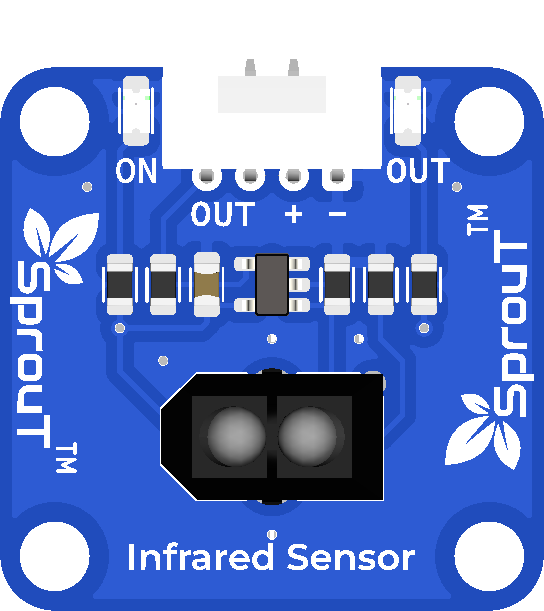

# SprouT Infrared Sensor

## Overview

<p align="center">
  
</p>

The **SprouT Infrared Sensor** is an input sensor module used to detect objects using infrared light.

It is commonly used in beginner electronics projects for object detection, obstacle detection, line detection, counting systems, and simple automation projects.

The sensor can be connected to the **SprouT MakerBox baseboard** through a digital input port using the `OUT`, `+`, and `-` pins.

Common project examples include:

- Obstacle detection
- Object counter
- Line-following robot
- Touchless trigger system
- Automatic door project
- Smart dustbin project
- Conveyor counting system
- IR detection alarm

---

## Description

The Infrared Sensor uses an infrared transmitter and receiver pair.

The transmitter sends infrared light. When an object is placed in front of the sensor, the infrared light reflects back to the receiver. The module then produces an output signal through the `OUT` pin.

In simple terms:

```text
No object detected  → output state changes one way
Object detected     → output state changes the opposite way
```

Depending on the module circuit, the output may become `LOW` or `HIGH` when an object is detected.

For many IR obstacle sensors:

```text
Object detected     → OUT = LOW
No object detected  → OUT = HIGH
```

However, this can be different depending on the module design, so always test the output using the Serial Monitor first.

---

## Main Features

- Detects nearby objects
- Uses infrared reflection
- Simple 3-pin connection
- Digital output signal
- Easy to use with Arduino and ESP32
- Plug-and-play with SprouT baseboard
- Suitable for beginner robotics and automation projects
- Can trigger LED, buzzer, relay, motor, or counter system

---

## Typical Specifications

| Item | Description |
|---|---|
| Sensor Type | Infrared reflection sensor |
| Output Type | Digital output |
| Pins | OUT, +, - |
| Operating Voltage | Usually 3.3V or 5V depending on module/baseboard |
| Detection Method | Reflected infrared light |
| Common Use | Object detection, obstacle detection, line detection |
| Compatible Boards | Arduino, ESP32, SprouT MakerBox baseboard |

> The detection distance depends on the object color, surface, angle, lighting condition, and sensor sensitivity.

---

## Pinout

The SprouT Infrared Sensor has 3 main pins.

| Sensor Pin | Function | Description |
|---|---|---|
| **OUT** | Signal Output | Sends detection signal to the microcontroller |
| **+** | Power | Connects to VCC from the baseboard |
| **-** | Ground | Connects to GND from the baseboard |

---

## Plug and Play with SprouT Baseboard

The SprouT MakerBox baseboard has digital input ports for sensors like the Infrared Sensor.

### Step 1: Turn off the power

Before connecting the IR sensor, turn off the baseboard power.

This helps prevent accidental short circuits or wrong pin connections.

---

### Step 2: Locate the digital input port

Find a digital input port on the SprouT baseboard.

The port usually contains:

```text
Signal
VCC
GND
```

or:

```text
OUT
+
-
```

---

### Step 3: Connect the IR sensor

Connect the IR sensor to the baseboard.

| Infrared Sensor | SprouT Baseboard |
|---|---|
| OUT | Digital Signal Pin |
| + | VCC / + |
| - | GND / - |

Make sure the sensor is not connected backwards.

---

### Step 4: Power on the baseboard

After checking the connection, power on the baseboard.

Some modules may have a small onboard LED that changes when an object is detected.

---

### Step 5: Test the sensor

Place an object in front of the sensor.

Open the Serial Monitor and check whether the output changes between `HIGH` and `LOW`.

---

## How It Works

The sensor works by using infrared light.

```text
IR LED sends invisible infrared light
        ↓
Object reflects the infrared light
        ↓
IR receiver detects the reflected light
        ↓
Sensor changes OUT signal
        ↓
Microcontroller reads HIGH or LOW
```

Example logic:

```text
Object detected     → sensor output changes
Object removed      → sensor output returns to normal
```

This output can be used to control other components such as:

- LED
- Buzzer
- Relay
- Motor
- LCD message
- Counter variable

---

## Arduino Example

This example reads the IR sensor and displays the result on the Serial Monitor.

```cpp
/*
  SprouT Infrared Sensor Test
  Board: Arduino Uno / Nano

  Connection:
  Infrared Sensor OUT -> D2
  Infrared Sensor +   -> 5V
  Infrared Sensor -   -> GND
*/

#define IR_SENSOR_PIN 2

void setup() {
  Serial.begin(9600);
  pinMode(IR_SENSOR_PIN, INPUT);

  Serial.println("SprouT Infrared Sensor Ready");
}

void loop() {
  int sensorState = digitalRead(IR_SENSOR_PIN);

  Serial.print("IR Sensor State: ");
  Serial.print(sensorState);

  if (sensorState == LOW) {
    Serial.println(" | Object Detected");
  } else {
    Serial.println(" | No Object");
  }

  delay(300);
}
```

> If your result is reversed, change the condition from `sensorState == LOW` to `sensorState == HIGH`.

---

## ESP32 Example

```cpp
/*
  SprouT Infrared Sensor Test
  Board: ESP32

  Connection:
  Infrared Sensor OUT -> GPIO 4
  Infrared Sensor +   -> 3.3V or suitable baseboard VCC
  Infrared Sensor -   -> GND
*/

#define IR_SENSOR_PIN 4

void setup() {
  Serial.begin(115200);
  pinMode(IR_SENSOR_PIN, INPUT);

  Serial.println("ESP32 Infrared Sensor Ready");
}

void loop() {
  int sensorState = digitalRead(IR_SENSOR_PIN);

  Serial.print("IR Sensor State: ");
  Serial.print(sensorState);

  if (sensorState == LOW) {
    Serial.println(" | Object Detected");
  } else {
    Serial.println(" | No Object");
  }

  delay(300);
}
```

---

## Example Application: IR Sensor with LED

This example turns on an LED when an object is detected.

```cpp
#define IR_SENSOR_PIN 2
#define LED_PIN 8

void setup() {
  pinMode(IR_SENSOR_PIN, INPUT);
  pinMode(LED_PIN, OUTPUT);

  Serial.begin(9600);
}

void loop() {
  int sensorState = digitalRead(IR_SENSOR_PIN);

  if (sensorState == LOW) {
    digitalWrite(LED_PIN, HIGH);
    Serial.println("Object Detected - LED ON");
  } else {
    digitalWrite(LED_PIN, LOW);
    Serial.println("No Object - LED OFF");
  }

  delay(200);
}
```

---

## Example Application: Object Counter

This example counts how many times an object passes in front of the sensor.

```cpp
#define IR_SENSOR_PIN 2

int counter = 0;
bool objectDetected = false;

void setup() {
  pinMode(IR_SENSOR_PIN, INPUT);
  Serial.begin(9600);

  Serial.println("IR Object Counter Ready");
}

void loop() {
  int sensorState = digitalRead(IR_SENSOR_PIN);

  if (sensorState == LOW && objectDetected == false) {
    counter++;
    objectDetected = true;

    Serial.print("Object Count: ");
    Serial.println(counter);
  }

  if (sensorState == HIGH) {
    objectDetected = false;
  }

  delay(50);
}
```

---

## Applications

- Object detection
- Obstacle avoidance
- Line-following robot
- Object counter
- Smart dustbin
- Touchless switch
- Automatic door trigger
- Conveyor item counter
- Security alarm trigger
- Robot navigation

---

## Troubleshooting

### Problem: Sensor always detects an object

Possible causes:

- Object is too close
- Sensor is facing a reflective surface
- Strong light is affecting the sensor
- Wrong logic condition in the code
- Sensor sensitivity is too high

Solution:

- Move the sensor away from reflective surfaces
- Test in a normal lighting environment
- Check the Serial Monitor value
- Reverse the `HIGH` / `LOW` condition if needed

---

### Problem: Sensor never detects an object

Possible causes:

- Wrong wiring
- OUT pin connected to the wrong pin
- Object is too far
- Object surface does not reflect infrared well
- Sensor is not powered

Solution:

- Check `OUT`, `+`, and `-` connections
- Move the object closer
- Try a white or reflective object
- Confirm the correct digital pin is used in the code

---

### Problem: Reading is unstable

Possible causes:

- Loose connection
- Moving object
- Strong sunlight
- Reflective background
- Sensor angle is not suitable

Solution:

- Use shorter wires
- Keep the sensor stable
- Avoid direct sunlight
- Adjust the sensor angle
- Add a short delay or debounce logic in code

---

### Problem: Output is reversed

Some IR modules output `LOW` when an object is detected. Others may output `HIGH`.

Solution:

Check the Serial Monitor and modify the code condition.

Example:

```cpp
if (sensorState == LOW) {
  // object detected
}
```

Change to:

```cpp
if (sensorState == HIGH) {
  // object detected
}
```

---

## FAQ

### Is the Infrared Sensor analog or digital?

This SprouT IR sensor is normally used as a digital sensor through the `OUT` pin.

---

### Can it detect all objects?

Not always. Detection depends on the object's color, surface, shape, distance, and reflectiveness.

---

### Can it detect black objects?

Black objects absorb more infrared light, so they may be harder to detect.

---

### Can I use it with ESP32?

Yes. Connect `OUT` to a suitable GPIO input pin.

---

### Can I use it for line-following robots?

Yes. IR sensors are commonly used for line detection, especially for detecting contrast between black and white surfaces.

---

### Why is the sensor affected by sunlight?

Sunlight contains infrared light, so strong sunlight may interfere with the sensor.

---

## Safety Notes

- Do not reverse the `+` and `-` pins.
- Do not connect the sensor to a voltage higher than supported.
- Turn off power before connecting or removing the module.
- Avoid using it as a certified safety device.

---

## See Also

- [SprouT Light Sensor](Light-Sensor.md)
- [SprouT LED](../output-components/LED.md)
- [SprouT Buzzer](../output-components/Buzzer.md)
- [SprouT Relay](../output-components/Relay.md)

---

*Last Updated: July 2026*  