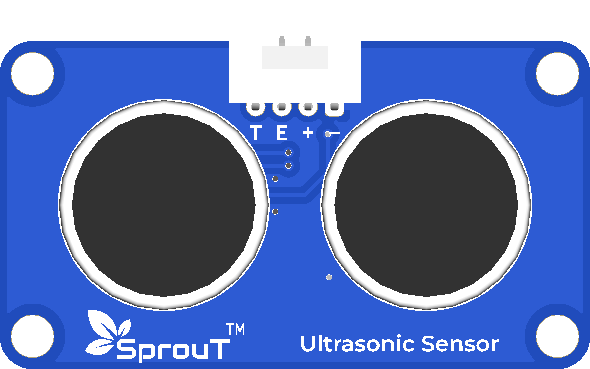

# SprouT Ultrasonic Sensor

## Overview

<p align="center">
  
</p>

The **SprouT Ultrasonic Sensor** is an input sensor module used to measure distance.

It works by sending ultrasonic sound waves and measuring how long the sound takes to bounce back from an object.

This sensor is useful for distance measurement, obstacle detection, water level projects, robot navigation, and automatic control systems.

Common project examples include:

- Distance measuring device
- Obstacle avoidance robot
- Smart dustbin
- Water level monitoring
- Parking sensor project
- Automatic door trigger
- Object detection system
- Robot navigation

---

## Description

The Ultrasonic Sensor measures distance using sound.

It sends a short ultrasonic pulse from the transmitter. When the sound hits an object, it reflects back to the receiver. The sensor measures the time taken for the sound to return.

The microcontroller then calculates the distance using this time.

Simple idea:

```text
Short return time → object is near
Long return time  → object is far
No return signal  → object may be out of range
```

The SprouT Ultrasonic Sensor uses a 4-pin connection:

```text
TRIG
ECHO
+
-
```

or similar labels depending on the baseboard.

---

## Main Features

- Measures distance without touching the object
- Uses ultrasonic sound waves
- Suitable for obstacle detection
- Easy to use with Arduino and ESP32
- Plug-and-play with SprouT baseboard
- Useful for robotics projects
- Can display distance on LCD or Serial Monitor
- Can trigger LED, buzzer, relay, or motor

---

## Typical Specifications

| Item | Description |
|---|---|
| Sensor Type | Ultrasonic distance sensor |
| Measurement Type | Distance |
| Pins | TRIG, ECHO, +, - |
| Operating Voltage | Usually 5V depending on module/baseboard |
| Typical Range | Around 2 cm to 400 cm |
| Common Accuracy | Basic educational accuracy |
| Output Type | Pulse timing signal |
| Compatible Boards | Arduino, ESP32, SprouT MakerBox baseboard |

> The actual distance range depends on object size, surface, angle, and environment.

---

## Pinout

The SprouT Ultrasonic Sensor has 4 main pins.

| Sensor Pin | Function | Description |
|---|---|---|
| **TRIG** | Trigger | Microcontroller sends a pulse to start measurement |
| **ECHO** | Echo | Sensor returns a pulse based on distance |
| **+** | Power | Connects to VCC from the baseboard |
| **-** | Ground | Connects to GND from the baseboard |

---

## Plug and Play with SprouT Baseboard

The SprouT MakerBox baseboard has a sensor port for the Ultrasonic Sensor.

### Step 1: Turn off the power

Before connecting the Ultrasonic Sensor, turn off the baseboard power.

This prevents wrong wiring and accidental short circuits.

---

### Step 2: Locate the ultrasonic sensor port

Find the Ultrasonic Sensor port on the SprouT baseboard.

It may be labeled as:

```text
TRIG
ECHO
+
-
```

or:

```text
T
E
VCC
GND
```

---

### Step 3: Connect the Ultrasonic Sensor

Connect the sensor to the baseboard.

| Ultrasonic Sensor | SprouT Baseboard |
|---|---|
| TRIG / T | Trigger Pin |
| ECHO / E | Echo Pin |
| + | VCC / + |
| - | GND / - |

Make sure the module is not plugged in backwards.

---

### Step 4: Power on the baseboard

After checking the connection, power on the baseboard.

---

### Step 5: Upload the code

Upload the ultrasonic distance measuring code to your microcontroller.

Open the Serial Monitor to view distance readings.

---

## How It Works

The Ultrasonic Sensor works using sound waves.

Simple flow:

```text
Microcontroller sends 10 microsecond trigger pulse
        ↓
Sensor sends ultrasonic sound wave
        ↓
Sound wave hits an object
        ↓
Sound wave reflects back
        ↓
Echo pin outputs pulse duration
        ↓
Microcontroller calculates distance
```

Distance formula:

```text
Distance = (Time × Speed of Sound) / 2
```

In Arduino code, the common formula is:

```cpp
distanceCm = duration * 0.0343 / 2;
```

Why divide by 2?

Because the sound travels:

```text
Sensor → Object → Sensor
```

So the measured time is for the round trip.

---

## Arduino Example

```cpp
/*
  SprouT Ultrasonic Sensor Test
  Board: Arduino Uno / Nano

  Connection:
  Ultrasonic TRIG -> D9
  Ultrasonic ECHO -> D10
  Ultrasonic +    -> 5V
  Ultrasonic -    -> GND
*/

#define TRIG_PIN 9
#define ECHO_PIN 10

void setup() {
  Serial.begin(9600);

  pinMode(TRIG_PIN, OUTPUT);
  pinMode(ECHO_PIN, INPUT);

  Serial.println("SprouT Ultrasonic Sensor Ready");
}

void loop() {
  long duration;
  float distanceCm;

  digitalWrite(TRIG_PIN, LOW);
  delayMicroseconds(2);

  digitalWrite(TRIG_PIN, HIGH);
  delayMicroseconds(10);
  digitalWrite(TRIG_PIN, LOW);

  duration = pulseIn(ECHO_PIN, HIGH, 30000);

  if (duration == 0) {
    Serial.println("Out of range or no object detected");
  } else {
    distanceCm = duration * 0.0343 / 2;

    Serial.print("Distance: ");
    Serial.print(distanceCm);
    Serial.println(" cm");
  }

  delay(500);
}
```

---

## ESP32 Example

```cpp
/*
  SprouT Ultrasonic Sensor Test
  Board: ESP32

  Connection:
  Ultrasonic TRIG -> GPIO 5
  Ultrasonic ECHO -> GPIO 18
  Ultrasonic +    -> suitable baseboard VCC
  Ultrasonic -    -> GND

  Important:
  If using a raw 5V ultrasonic sensor manually with ESP32,
  use level shifting or a voltage divider on the ECHO pin.
  The SprouT baseboard may already handle this depending on design.
*/

#define TRIG_PIN 5
#define ECHO_PIN 18

void setup() {
  Serial.begin(115200);

  pinMode(TRIG_PIN, OUTPUT);
  pinMode(ECHO_PIN, INPUT);

  Serial.println("ESP32 Ultrasonic Sensor Ready");
}

void loop() {
  long duration;
  float distanceCm;

  digitalWrite(TRIG_PIN, LOW);
  delayMicroseconds(2);

  digitalWrite(TRIG_PIN, HIGH);
  delayMicroseconds(10);
  digitalWrite(TRIG_PIN, LOW);

  duration = pulseIn(ECHO_PIN, HIGH, 30000);

  if (duration == 0) {
    Serial.println("Out of range or no object detected");
  } else {
    distanceCm = duration * 0.0343 / 2;

    Serial.print("Distance: ");
    Serial.print(distanceCm);
    Serial.println(" cm");
  }

  delay(500);
}
```

---

## Example Application: Distance Warning LED

This example turns on an LED when an object is closer than 20 cm.

```cpp
#define TRIG_PIN 9
#define ECHO_PIN 10
#define LED_PIN 8

float warningDistance = 20.0;

void setup() {
  pinMode(TRIG_PIN, OUTPUT);
  pinMode(ECHO_PIN, INPUT);
  pinMode(LED_PIN, OUTPUT);

  Serial.begin(9600);
}

void loop() {
  long duration;
  float distanceCm;

  digitalWrite(TRIG_PIN, LOW);
  delayMicroseconds(2);

  digitalWrite(TRIG_PIN, HIGH);
  delayMicroseconds(10);
  digitalWrite(TRIG_PIN, LOW);

  duration = pulseIn(ECHO_PIN, HIGH, 30000);

  if (duration == 0) {
    Serial.println("No object detected");
    digitalWrite(LED_PIN, LOW);
  } else {
    distanceCm = duration * 0.0343 / 2;

    Serial.print("Distance: ");
    Serial.print(distanceCm);
    Serial.println(" cm");

    if (distanceCm <= warningDistance) {
      digitalWrite(LED_PIN, HIGH);
    } else {
      digitalWrite(LED_PIN, LOW);
    }
  }

  delay(300);
}
```

---

## Example Application: Parking Sensor with Buzzer

This example makes the buzzer beep faster when an object is closer.

```cpp
#define TRIG_PIN 9
#define ECHO_PIN 10
#define BUZZER_PIN 8

void setup() {
  pinMode(TRIG_PIN, OUTPUT);
  pinMode(ECHO_PIN, INPUT);
  pinMode(BUZZER_PIN, OUTPUT);

  Serial.begin(9600);
}

void loop() {
  long duration;
  float distanceCm;

  digitalWrite(TRIG_PIN, LOW);
  delayMicroseconds(2);

  digitalWrite(TRIG_PIN, HIGH);
  delayMicroseconds(10);
  digitalWrite(TRIG_PIN, LOW);

  duration = pulseIn(ECHO_PIN, HIGH, 30000);

  if (duration == 0) {
    digitalWrite(BUZZER_PIN, LOW);
    Serial.println("No object detected");
    delay(300);
    return;
  }

  distanceCm = duration * 0.0343 / 2;

  Serial.print("Distance: ");
  Serial.print(distanceCm);
  Serial.println(" cm");

  if (distanceCm <= 10) {
    digitalWrite(BUZZER_PIN, HIGH);
    delay(100);
    digitalWrite(BUZZER_PIN, LOW);
    delay(100);
  } 
  else if (distanceCm <= 30) {
    digitalWrite(BUZZER_PIN, HIGH);
    delay(200);
    digitalWrite(BUZZER_PIN, LOW);
    delay(300);
  } 
  else if (distanceCm <= 60) {
    digitalWrite(BUZZER_PIN, HIGH);
    delay(100);
    digitalWrite(BUZZER_PIN, LOW);
    delay(700);
  } 
  else {
    digitalWrite(BUZZER_PIN, LOW);
    delay(300);
  }
}
```

---

## Calibration and Testing Guide

To test the Ultrasonic Sensor:

1. Connect the sensor to the baseboard.
2. Upload the test code.
3. Open Serial Monitor.
4. Place an object about 10 cm in front of the sensor.
5. Check the displayed distance.
6. Move the object farther away.
7. Confirm that the distance reading increases.

Example expected result:

```text
Object close: 10 cm
Object farther: 50 cm
Object very far: 100 cm or more
```

---

## Applications

- Distance measuring device
- Obstacle avoidance robot
- Parking sensor
- Smart dustbin
- Water level detection
- Automatic door trigger
- Robot navigation
- Object detection
- Height measurement project
- Safety distance warning system

---

## Troubleshooting

### Problem: Distance always shows 0

Possible causes:

- ECHO pin not connected correctly
- Wrong pin number in code
- Sensor not powered
- Object is too close
- Wiring is reversed

Solution:

- Check `TRIG`, `ECHO`, `+`, and `-`
- Confirm the code uses the correct pins
- Place the object at least a few centimeters away
- Check power connection

---

### Problem: Distance always shows out of range

Possible causes:

- No object in front of sensor
- Object is too far
- Object surface absorbs sound
- Sensor is angled incorrectly
- ECHO signal is not being received

Solution:

- Place a flat object in front of the sensor
- Try a book, cardboard, or wall
- Keep the sensor facing straight
- Reduce the distance

---

### Problem: Reading is unstable

Possible causes:

- Object surface is uneven
- Sensor is moving
- Strong airflow
- Electrical noise
- Object is at an angle

Solution:

- Use a flat object for testing
- Keep the sensor stable
- Take multiple readings and average them
- Avoid measuring soft fabric or angled surfaces

Example averaging:

```cpp
float total = 0;
int validReadings = 0;

for (int i = 0; i < 5; i++) {
  // put distance reading function here
  // add valid distance to total
  delay(50);
}
```

---

### Problem: ESP32 reading is wrong or unstable

Possible causes:

- ECHO pin voltage is too high
- No voltage divider used when wiring manually
- Wrong GPIO pin selected
- Loose connection

Solution:

- Use the SprouT baseboard ultrasonic port if available
- If wiring manually, protect the ESP32 ECHO pin using a voltage divider or level shifter
- Use stable power and short wires

---

### Problem: Cannot detect soft object

Soft materials such as cloth, sponge, or foam may absorb sound.

Solution:

Use a harder and flatter object for testing.

---

## FAQ

### Is the Ultrasonic Sensor analog or digital?

It uses digital timing signals through `TRIG` and `ECHO`.

---

### Can it measure exact distance?

It can measure approximate distance for learning and project use, but it is not a precision measuring tool.

---

### Why does the sensor have two round parts?

One part sends ultrasonic sound, and the other part receives the reflected sound.

---

### Can I use it with ESP32?

Yes, but if the ultrasonic module outputs 5V on the ECHO pin, the ESP32 input must be protected using a voltage divider or level shifter unless the baseboard already handles it.

---

### Can it measure water level?

Yes. It can be mounted above a tank to measure distance to the water surface.

---

### Can it detect people?

Yes, if the person is within range and the sensor is facing them properly.

---

### Why divide by 2 in the distance formula?

Because the sound travels to the object and back to the sensor, so the measured time is double the one-way distance.

---

## Safety Notes

- Do not reverse the `+` and `-` pins.
- Do not connect the sensor to a voltage higher than supported.
- Turn off power before connecting or removing the module.
- If using ESP32 manually, protect the ECHO pin from 5V.
- Avoid using this sensor for certified safety-critical distance detection.

---

## See Also

- [SprouT Tilt Sensor](Tilt-Sensor.md)
- [SprouT LED](../output-components/LED.md)
- [SprouT Buzzer](../output-components/Buzzer.md)
- [SprouT LCD](../output-components/LCD.md)
- [SprouT Relay](../output-components/Relay.md)

---

*Last Updated: July 2026*  